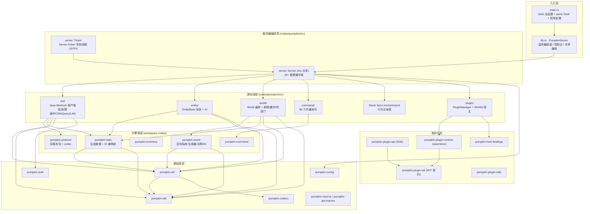

# 01 · 项目概览

> 分析时间：2026-09-19 · 分析范围：`F:\Github\repo\Papokin`（排除 `REF/` 参考资料目录）· 模式：采样深度分析

## 1. 项目快照

| 项目 | 内容 |
|------|------|
| **项目名称** | Pumpkin（本仓库 Papokin 为其工作副本），纯 Rust 实现的 Minecraft 服务器 |
| **定位** | 高性能、可扩展、兼容 Java 版与 Bedrock（基岩）版最新版本的 Minecraft 服务端 |
| **语言** | Rust（edition 2024，MSRV 1.96，`rust-toolchain.toml` 锁定） |
| **构建体系** | Cargo workspace（`Cargo.toml:1-24`，resolver = "3"），20 个成员（18 crate + 2 tools） |
| **协议版本** | `0.1.0+26.3-26.51`（Java 协议版本与 Bedrock 26.3 双栈，`Cargo.toml:111`） |
| **代码规模** | **2718 个 `.rs` 文件，约 150 万行**；978 个测试函数；另有 73MB 生成数据（`pumpkin-data/src/generated/`） |
| **许可证** | 服务器 GPLv3；插件 API（`pumpkin-plugin-api`/`pumpkin-plugin-wit`）MIT OR Apache-2.0 双许可 |
| **CI/CD** | GitHub Actions：fmt / cargo-machete / clippy(debug+release) / WIT 一致性 / nextest+doctest / Android 模拟器测试 / 多平台 release + SignPath 签名 / nightly 发布 |
| **质量门槛** | 全 workspace `clippy::all/pedantic/nursery/cargo = deny`，且 `unwrap/expect/panic/dbg = deny`（`Cargo.toml:29-65`）——生产级严格度 |

## 2. 技术栈全景

| 领域 | 选型 | 证据 |
|------|------|------|
| 异步运行时 | tokio 1.53（多线程 runtime 承载网络/IO） | `Cargo.toml:133`，`main.rs:48` `#[tokio::main]` |
| 数据并行 | rayon 1.12（世界/实体/方块并行 tick、区块生成专用池） | `Cargo.toml:142`，`main.rs:56-59` |
| 并发原语 | crossbeam(SegQueue)、dashmap、arc-swap、slotmap、lru | `Cargo.toml:143,163,217,215` |
| 序列化 | serde + serde_json + toml + postcard；自研 NBT（`pumpkin-nbt`） | `Cargo.toml:146-149,240` |
| 插件运行时 | wasmtime（git rev 固定，Component Model + async + GC）+ wit-bindgen 0.61 | `Cargo.toml:230-238` |
| 基岩网络 | webrtc 0.20（NetherNet/ICE）、自研 RakNet 风格 UDP 状态协议 | `Cargo.toml:236`，`net/bedrock/` |
| 加密/认证 | aes/cfb8（协议加密）、rsa、ecdsa/p384、ed25519-dalek、rustls(ring) | `Cargo.toml:152-164,199-246` |
| HTTP | reqwest(rustls) + axum/hyper（WASI http 桥） | `Cargo.toml:220,234-235` |
| 可观测 | tracing + tracing-subscriber + console-subscriber（tokio-console） | `Cargo.toml:207-214` |
| 控制台 | rustyline（历史/补全/Emacs 编辑模式） | `Cargo.toml:203`，`lib.rs:120-143` |
| 压缩 | flate2（zlib）、async-compression、lz4-java-wrc、ruzstd（区块格式） | `Cargo.toml:153,165,173,204` |
| 宏 | syn/quote/proc-macro2（5 个过程宏 crate） | `Cargo.toml:134` |

## 3. 项目目标（README.md:19-25）

- **性能**：多线程利用最大化（rayon 并行 tick 世界/实体/区块生成）
- **兼容**：同时支持最新 Java 版与 Bedrock 版协议，遵循原版机制
- **安全**：主动防御已知漏洞（包限速、加密、代理验证、WASM 沙箱权限）
- **灵活**：几乎所有特性可通过 TOML 配置开关
- **可扩展**：以 WASM 组件模型为一等公民的插件体系

## 4. 代码规模分布（按 crate）

| crate | .rs 文件数 | 角色 |
|-------|-----------|------|
| `pumpkin`（主 crate） | 1296 | 服务器本体：网络/实体/世界编排/命令/方块/物品/插件宿主 |
| `pumpkin-protocol` | 400 | 双版本协议包定义与编解码（Java 275 文件 + Bedrock 96 文件） |
| `pumpkin-plugin-api` | 307 | 面向插件作者的 SDK（wit-bindgen 生成 + Rust 封装） |
| `pumpkin-world` | 272 | 区块/生成/光照/POI/存档格式的世界引擎（含 7 个子 crate） |
| `tools/pumpkin-codegen` | 102 | 从 `assets/*.json` 生成 `pumpkin-data` 的代码生成器 |
| `pumpkin-data` | 97 | 生成的不变游戏数据（方块/物品/实体/协议 ID 重映射…） |
| `pumpkin-command` | 66 | Brigadier 风格命令树框架 |
| `pumpkin-util` | 48 | 通用工具（TextComponent/数学/随机/噪声/权限模型） |
| `pumpkin-inventory` | 44 | 容器与屏幕处理器（ScreenHandler 体系） |
| 其余 11 个 | <30 各 | 配置/认证/NBT/codecs/宏/gametest/host-bindings 等 |

## 5. 一图总览：系统架构分层

**分层规则**：`pumpkin`（主 crate）位于顶层，依赖几乎所有引擎库；`pumpkin-data`/`pumpkin-util`/`pumpkin-nbt`/`pumpkin-codecs` 是被广泛复用的底层；插件生态五件套围绕 WIT 契约自成一派，主 crate 仅依赖 `plugin-runtime` + `host-bindings`。

## 6. 核心发现（TL;DR）

1. **双版本协议栈是最大特色**：`ClientPlatform` 枚举（`net/mod.rs:138`）把 Java(TCP) 与 Bedrock(WebRTC/NetherNet) 两种连接统一到同一套 `Player` 游戏逻辑下，出站包通过 `enqueue_packet_editioned<J, B>`（`net/mod.rs:226`）按版本分别序列化。
2. **tick 驱动一切**：单个 `Server-Ticker` 专用线程以 50ms/tick 推进（`server/ticker.rs:20`），世界间、玩家间、实体批次、方块计划 tick 全部 rayon 并行；网络包却在玩家 tick 内同步消费（`entity/player.rs:2490`，64 包/tick 上限）。
3. **插件系统基于 WASM 组件模型**：WIT world `pumpkin:plugin@0.1.0` 定义 30+ host 接口与 10+ guest 导出（`pumpkin-plugin-wit/v0.1/plugin.wit`），事件经 `PluginManager::fire` 串行穿过 blocking handler（可取消），并有完善的沙箱（内存上限/目录预开/socket 策略/签名校验/热重载）。
4. **数据即代码**：`tools/pumpkin-codegen` 从 `assets/*.json`（官方数据提取）生成 73MB Rust 静态数据，通过 feature flag（`item_id_remap`、`bedrock_creative` 等）为两个协议版本提供不同 ID 映射。
5. **极端健壮性约束**：workspace 级 `clippy deny unwrap/expect/panic`，登录 30s 空闲超时、包速率限制、keep-alive 超时踢出、panic 生成崩溃报告并优雅关停（`main.rs:233-305`）。

## 7. 与本笔记其余部分的关系

- 目录与文件明细 → [02-目录结构.md](02-目录结构.md)
- crate 间/外部依赖图 → [03-依赖关系.md](03-依赖关系.md)
- 各子系统内部结构（含图） → [04-模块分析.md](04-模块分析.md)
- 数据在系统中的流动 → [05-数据流.md](05-数据流.md)
- 启动/tick/关停等控制路径 → [06-控制流.md](06-控制流.md)
