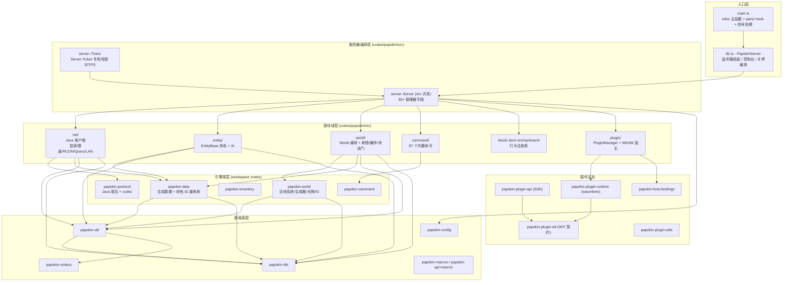

# 01 · 项目概览

> 分析时间：2026-09-19 · 分析范围：`F:\Github\repo\Papokin`（排除 `REF/` 参考资料目录）· 模式：采样深度分析

## 1. 项目快照

| 项目 | 内容 |
|------|------|
| **项目名称** | Papokin（Pumpkin 的 fork，2026-09-22 更名），纯 Rust 实现的 Minecraft Java 版服务器 |
| **定位** | 高性能、可扩展、兼容 Java 版最新版本的 Minecraft 服务端 |
| **语言** | Rust（edition 2024，MSRV 1.96；`rust-toolchain.toml` 固定 `channel = "stable"`） |
| **构建体系** | Cargo workspace（`Cargo.toml:3-24`，resolver = "3"），20 个成员（17 生产 crate + benchmark + 2 tools；crates/ 下另有非 Rust 的 papokin-plugin-wit WIT 契约包） |
| **协议版本** | `0.3.35+1.21.11`（Java 版 1.21.11，协议 774，`Cargo.toml:111`） |
| **代码规模** | **2825 个 `.rs` 文件，约 143.8 万行**；1226 个 lib 测试通过（2026-10-06 实测）；另有 67MB 生成数据（`papokin-data/src/generated/`） |
| **许可证** | 服务器 GPLv3；插件 API（`papokin-plugin-api`/`papokin-plugin-wit`）MIT OR Apache-2.0 双许可 |
| **CI/CD** | GitHub Actions：fmt / cargo-machete / clippy(debug+release) / WIT 一致性 / nextest+doctest / Android 模拟器测试 / 多平台 release + SignPath 签名 / nightly 发布 |
| **质量门槛** | 全 workspace `clippy::all/pedantic/nursery/cargo = deny`，且 `unwrap/expect/panic/dbg = deny`（`Cargo.toml:28-107`）——生产级严格度 |

## 2. 技术栈全景

| 领域 | 选型 | 证据 |
|------|------|------|
| 异步运行时 | tokio 1.53（多线程 runtime 承载网络/IO） | `Cargo.toml:133`，`main.rs:48` `#[tokio::main]` |
| 数据并行 | rayon 1.12（世界/实体/方块并行 tick、区块生成专用池） | `Cargo.toml:142`，`main.rs:56-59` |
| 并发原语 | crossbeam(SegQueue)、dashmap、arc-swap、slotmap、lru | `Cargo.toml:143,163,217,215` |
| 序列化 | serde + serde_json + toml + postcard；自研 NBT（`papokin-nbt`） | `Cargo.toml:146-149,240` |
| 插件运行时 | wasmtime（git rev 固定，Component Model + async + GC）+ wit-bindgen 0.61 | `Cargo.toml:230-238` |
| 加密/认证 | aes/cfb8（协议加密）、rsa、ed25519-dalek、rustls(ring) | `Cargo.toml:152-164,199-246` |
| HTTP | reqwest(rustls) + axum/hyper（WASI http 桥） | `Cargo.toml:220,234-235` |
| 可观测 | tracing + tracing-subscriber + console-subscriber（tokio-console） | `Cargo.toml:207-214` |
| 控制台 | rustyline（历史/补全/Emacs 编辑模式） | `Cargo.toml:203`，`lib.rs:120-143` |
| 压缩 | flate2（zlib）、async-compression、lz4-java-wrc、ruzstd（区块格式） | `Cargo.toml:153,165,173,204` |
| 宏 | syn/quote/proc-macro2（2 个过程宏 crate：papokin-macros、papokin-api-macros） | `Cargo.toml:133` |

## 3. 项目目标（README.md）

- **性能**：多线程利用最大化（rayon 并行 tick 世界/实体/区块生成）
- **兼容**：支持最新 Java 版协议，遵循原版机制
- **安全**：主动防御已知漏洞（包限速、加密、代理验证、WASM 沙箱权限）
- **灵活**：几乎所有特性可通过 TOML 配置开关
- **可扩展**：以 WASM 组件模型为一等公民的插件体系

## 4. 代码规模分布（按 crate）

| crate | .rs 文件数 | 角色 |
|-------|-----------|------|
| `papokin`（主 crate） | 1371 | 服务器本体：网络/实体/世界编排/命令/方块/物品/插件宿主 |
| `papokin-plugin-api` | 409 | 面向插件作者的 SDK（wit-bindgen 生成 + Rust 封装） |
| `papokin-protocol` | 303 | Java 版协议包定义与编解码 |
| `papokin-world` | 272 | 区块/生成/光照/POI/存档格式的世界引擎 |
| `tools/papokin-codegen` | 101 | 从 `assets/*.json` 生成 `papokin-data` 的代码生成器 |
| `papokin-data` | 102 | 生成的不变游戏数据（方块/物品/实体/存档 ID 重映射…） |
| `papokin-command` | 66 | Brigadier 风格命令树框架 |
| `papokin-util` | 48 | 通用工具（TextComponent/数学/随机/噪声/权限模型） |
| `papokin-inventory` | 46 | 容器与屏幕处理器（ScreenHandler 体系） |
| 其余 10 个 | <30 各 | 配置/NBT/codecs/宏/gametest/host-bindings 等 |

## 5. 一图总览：系统架构分层

```mermaid
graph TB
    subgraph L0["入口层"]
        MAIN["main.rs<br/>tokio 主函数 + panic hook + 信号处理"]
        LIB["lib.rs · PapokinServer<br/>监听器组装 / 控制台 / 关停编排"]
    end
    subgraph L1["服务器编排层 (crates/papokin/src)"]
        SERVER["server::Server (Arc 共享)<br/>30+ 管理器字段"]
        TICKER["server::Ticker<br/>Server-Ticker 专用线程 20TPS"]
    end
    subgraph L2["游戏域层 (crates/papokin/src)"]
        NET["net/<br/>Java 客户端<br/>登录/限速/RCON/Query/LAN"]
        ENTITY["entity/<br/>EntityBase 体系 + AI"]
        WORLD["world/<br/>World 编排 + 刷怪/爆炸/传送门"]
        CMD["command/<br/>87 个内置命令"]
        BLOCK["block/ item/ enchantment/<br/>行为注册表"]
        PLUGIN["plugin/<br/>PluginManager + WASM 宿主"]
    end
    subgraph L3["引擎库层 (workspace crates)"]
        PW["papokin-world<br/>区块系统/生成器/光照/IO"]
        PROTO["papokin-protocol<br/>Java 版包 + codec"]
        INV["papokin-inventory"]
        PCMD["papokin-command"]
        DATA["papokin-data<br/>生成数据 + 存档 ID 重映射"]
    end
    subgraph L4["基础库层"]
        UTIL["papokin-util"]
        NBT["papokin-nbt"]
        CODECS["papokin-codecs"]
        CONFIG["papokin-config"]
        MACROS["papokin-macros / papokin-api-macros"]
    end
    subgraph L5["插件生态"]
        WIT["papokin-plugin-wit (WIT 契约)"]
        PAPI["papokin-plugin-api (SDK)"]
        PRUNTIME["papokin-plugin-runtime (wasmtime)"]
        HBIND["papokin-host-bindings"]
        PUTILS["papokin-plugin-utils"]
    end

    MAIN --> LIB
    LIB --> SERVER
    TICKER --> SERVER
    SERVER --> NET & ENTITY & WORLD & CMD & BLOCK & PLUGIN
    NET --> PROTO
    WORLD --> PW
    CMD --> PCMD
    ENTITY & WORLD & NET --> DATA
    WORLD & NET & ENTITY --> UTIL & NBT
    PLUGIN --> PRUNTIME & HBIND
    PRUNTIME --> WIT
    PAPI --> WIT
    SERVER --> CONFIG
    UTIL --> NBT & CODECS
    PW & DATA --> UTIL & NBT
```

**分层规则**：`papokin`（主 crate）位于顶层，依赖几乎所有引擎库；`papokin-data`/`papokin-util`/`papokin-nbt`/`papokin-codecs` 是被广泛复用的底层；插件生态五件套围绕 WIT 契约自成一派，主 crate 仅依赖 `plugin-runtime` + `host-bindings`。

## 6. 核心发现（TL;DR）

1. **Java 版协议栈是网络层的核心**：TCP 连接经 `net/` 的登录状态机（pending→config→play）处理，加密/压缩、Velocity/BungeeCord 代理验证与令牌桶包限速内建于网络层，所有连接最终统一到同一套 `Player` 游戏逻辑下。
2. **tick 驱动一切**：单个 `Server-Ticker` 专用线程以 50ms/tick 推进（`server/ticker.rs:20`），世界间、玩家间、实体批次、方块计划 tick 全部 rayon 并行；网络包却在玩家 tick 内同步消费（`entity/player.rs:2490`，64 包/tick 上限）。
3. **插件系统基于 WASM 组件模型**：WIT world `papokin:plugin@0.1.0` 定义 44 个 host import 接口与 18 项 guest 导出（`papokin-plugin-wit/v0.1/plugin.wit`，共 57 个 .wit 文件），事件经 `PluginManager::fire` 串行穿过 blocking handler（可取消），并有完善的沙箱（内存上限/目录预开/socket 策略/签名校验/热重载）。
4. **数据即代码**：`tools/papokin-codegen` 从 `assets/*.json`（官方数据提取）生成 67MB Rust 静态数据，通过 feature flag（`item_id_remap` 等 15 个 `*_id_remap`）提供跨版本 ID 重映射表，服务于 1.21.11 存档重写（见 [09-存档系统重写实现记录.md](09-存档系统重写实现记录.md)）。
5. **极端健壮性约束**：workspace 级 `clippy deny unwrap/expect/panic`，登录 30s 空闲超时、包速率限制、keep-alive 超时踢出、panic 生成崩溃报告并优雅关停（`main.rs:233-305`）。

## 7. 与本笔记其余部分的关系

- 目录与文件明细 → [02-目录结构.md](02-目录结构.md)
- crate 间/外部依赖图 → [03-依赖关系.md](03-依赖关系.md)
- 各子系统内部结构（含图） → [04-模块分析.md](04-模块分析.md)
- 数据在系统中的流动 → [05-数据流.md](05-数据流.md)
- 启动/tick/关停等控制路径 → [06-控制流.md](06-控制流.md)
- 存档系统对比/格式深挖/重写记录 → [07](07-存档系统对比-Pumpkin-vs-Papo.md)/[08](08-存档格式深挖-Pumpkin-vs-Papo.md)/[09](09-存档系统重写实现记录.md)
- 插件系统对比/强化记录/API 文档/覆盖复核 → [10](10-插件系统对比-Pumpkin-vs-Papo.md)/[11](11-插件API强化实现记录-Papo机制级覆盖.md)/[12](12-插件API文档.md)/[13](13-插件API覆盖复核-当前代码vs-Papo.md)
- 汉化记录/安全审计/CPU 修复记录 → [14](14-全仓汉化实现记录.md)/[15](15-安全与稳定性审计-入站包输入信任.md)/[16](16-CPU异常占用根因与修复.md)
