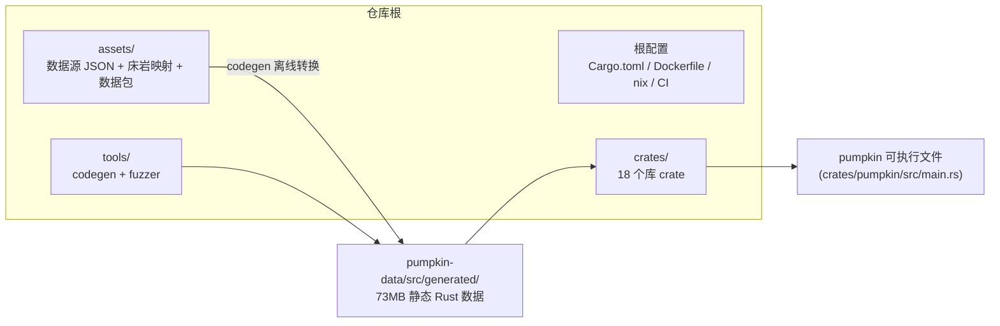

# 02 · 目录结构

> 分析范围排除 `REF/`（用户指定不纳入检测）。生成目录（`target/`、`.git/`）同样排除。

## 1. 仓库根目录总览

```
Papokin/
├── Cargo.toml                # workspace 定义：20 成员 + 统一依赖版本表 + 严格 clippy 门禁
├── Cargo.lock                # 锁定全部依赖（wasmtime 固定到 git rev）
├── rust-toolchain.toml       # 锁定 Rust 工具链版本
├── rustfmt.toml              # 代码格式（仅 1 项配置）
├── typos.toml                # CI 拼写检查配置
├── README.md / CONTRIBUTING.md / CODE_OF_CONDUCT.md / SECURITY.md / LICENSE
├── Dockerfile                # 容器化运行（多阶段构建）
├── docker-compose.yml        # 本地编排（java+bedrock UDP/TCP 端口）
├── egg-pumpkin.json          # Pterodactyl 面板部署模板
├── default.nix / shell.nix / flake.nix / flake.lock   # Nix 开发环境
├── .devcontainer/            # VS Code Dev Container
├── .github/                  # CI 工作流（见 §5）
├── assets/                   # 数据源（codegen 的输入）+ 服务器静态资源
│   ├── *.json                # 方块/属性/统计等原版数据提取
│   ├── bedrock/              # 基岩版映射数据（创造模式物品栏、生物群系…）
│   ├── datapacks/            # 内置数据包
│   └── NOTICE.md             # 第三方资产许可说明
├── crates/                   # 18 个核心 crate（§2）
├── tools/                    # 2 个工具（§3）
├── REF/                      # 【用户指定排除，不分析】
└── note/                     # 本笔记输出目录
```

## 2. crates/ —— 18 个 crate 的目录角色

```
crates/
│
├── pumpkin/ ================= 服务器本体（1296 文件，最大 crate）
│   └── src/
│       ├── main.rs           # 入口：tokio main、panic hook、信号处理、启动编排
│       ├── lib.rs            # PumpkinServer：监听器组装、控制台、统一 accept 循环、关停
│       ├── crash.rs          # CrashReport 崩溃报告
│       ├── error.rs          # PumpkinError trait（可踢出/严重度分级）
│       ├── logging.rs        # tracing 初始化、Gzip 滚动日志、rustyline 包装
│       ├── telemetry.rs      # 匿名遥测心跳（ed25519 签名）
│       ├── server/           # ★ Server 结构体 + Ticker 游戏循环 + 各种管理器
│       │   ├── mod.rs        #   Server（30+ 字段）、tick_worlds、shutdown
│       │   ├── ticker.rs     #   Ticker（Server-Ticker 线程，20TPS）
│       │   ├── tick_rate_manager.rs  # 冻结/单步/冲刺/变速
│       │   ├── scheduler.rs  #   TaskScheduler（插件延迟任务）+ /schedule 队列
│       │   ├── key_store.rs  #   RSA 密钥对（协议加密）
│       │   ├── connection_cache.rs   # ping 状态/品牌缓存
│       │   ├── recipe.rs / enchantment.rs / debug_profiler.rs
│       │   ├── server_test_manager.rs # GameTest 队列
│       │   └── seasonal_events.rs     # 愚人节彩蛋
│       ├── net/              # ★ 网络层
│       │   ├── mod.rs        #   ClientPlatform(Java/Bedrock)、发包 API、限速
│       │   ├── java/         #   Java 版：pending(登录状态机)/config/play 分包处理
│       │   ├── bedrock/      #   Bedrock 版：login/nethernet(WebRTC-ICE)/play
│       │   ├── proxy/        #   Velocity/BungeeCord/Vine 代理验证
│       │   ├── rcon/ query/ lan_broadcast.rs / chat/ / chunk_sender.rs
│       │   ├── authentication.rs  # Mojang sessionserver hasJoined 校验
│       │   └── packet_limiter.rs  # 令牌桶包限速
│       ├── entity/           # ★ 实体体系（290 文件）
│       │   ├── mod.rs        #   EntityBase trait + Entity/LivingEntity 结构
│       │   ├── player.rs     #   Player（7000+ 行）
│       │   ├── ai/           #   brain/(原版 Brain 框架) goal/(55 种目标) control/
│       │   ├── mob/ passive/ boss/ projectile/ vehicle/ decoration/
│       │   ├── effect/       #   状态效果
│       │   ├── combat.rs / hunger.rs / attributes.rs / breath.rs ...
│       │   └── synched_entity_data.rs  # 元数据同步（双版本）
│       ├── world/            # ★ 世界编排（主 crate 侧）
│       │   ├── mod.rs        #   World 结构体 + tick + 方块更新 flush
│       │   ├── chunker.rs    #   玩家视距票据计算
│       │   ├── natural_spawner.rs      # 自然刷怪
│       │   ├── entity_tracker.rs       # 实体可见性追踪广播
│       │   ├── explosion.rs / portal/ / dragon_fight.rs / raid.rs
│       │   ├── scoreboard.rs / weather.rs / time.rs / border.rs
│       │   └── active_chunks.rs / loot.rs / map.rs ...
│       ├── block/            # 方块行为：registry + blocks/(红石/交互…) + entities/ + fluid/
│       ├── item/             # 物品行为：registry + items/
│       ├── enchantment/      # 附魔效果 effects/ + helper
│       ├── command/          # 命令绑定：CommandSender、参数类型、commands/(86 个内置命令)
│       ├── data/             # 存档 JSON：封禁/OP/白名单/usercache + datapack/ + advancement
│       └── plugin/           # ★ 插件宿主：PluginManager、loader/(native+wasm)、api/(事件+Context)
│
├── pumpkin-world ============ 世界引擎（272 文件，含 7 个子 crate）
│   └── src/
│       ├── level.rs          # Level：区块表/IO 任务/存档目录/光照引擎
│       ├── world.rs          # 只读 World 视图（插件 API 用）
│       ├── chunk_system/     # ★ 区块加载 DAG 调度：schedule/dag/chunk_holder/worker_logic
│       ├── chunk/            # ChunkData 内存表示 + format/(anvil|linear|pump) + io/
│       ├── generation/       # ★ 生成管线：noise/ feature/ structure/ carver/ surface/ blender/
│       │   └── generator/    #   VanillaGenerator / FlatGenerator（superflat）
│       ├── block/            # Block/BlockState/Fluid 静态定义与查询
│       ├── lighting/         # 光照引擎（天空光/方块光）
│       ├── biome/  poi/  tick/  data/  dimension.rs  world_info/(level.dat)
│       └── 子 crate：chunk / chunk_io / chunk_gen / chunk_gen_concurrent / jigsaw / noise_router / template_pool
│
├── pumpkin-protocol ========= 协议库（400 文件）
│   └── src/
│       ├── java/client/      # C→S 方向：config/dialog/login/play/status 各阶段包
│       ├── java/server/      # S→C 方向：同上分组
│       ├── bedrock/client|server/  # 基岩版双向包（add_actor/boss_event/…）
│       ├── codec/            # VarInt/VarLong/LittleEndian/BitSet/ItemStack… 编解码器
│       ├── ser/  serial/     # 读取器/写入器基础设施
│       └── lib.rs            # ConnectionState 枚举（HandShake→Status→Login→Transfer→Config→Play）
│
├── pumpkin-data ============= 生成数据（97 文件 + 73MB generated/）
│   └── src/generated/        # blocks/items/entity_types/particles/sounds/*_id_remap… 全静态数据
│
├── pumpkin-plugin-api ======= 插件 SDK（307 文件，MIT/Apache 双许可）
├── pumpkin-plugin-wit ======== WIT 接口契约（v0.1/plugin.wit 为唯一真源）
├── pumpkin-plugin-runtime === wasmtime 执行器（Store 生命周期/重入策略/tokio 桥）
├── pumpkin-plugin-utils ===== 插件作者工具（市场许可证/更新检查）
├── pumpkin-host-bindings ==== wasmtime bindgen! 生成的宿主侧 trait
├── pumpkin-api-macros ======= native(dylib) 插件过程宏（#[plugin_impl] 等）
├── pumpkin-macros =========== 宿主过程宏（Event/cancellable/packet/pumpkin_block/translate_cross）
├── pumpkin-command ========== 命令树框架（66 文件：dispatcher/tree/node/args）
├── pumpkin-inventory ======== 容器系统（44 文件：ScreenHandler 家族/crafting/anvil/…）
├── pumpkin-config =========== TOML 配置（basic+advanced+telemetry 三层）
├── pumpkin-auth ============= Bedrock 微软 OIDC/JWT 链验证
├── pumpkin-nbt ============== NBT 解析器（Java 大端 / Bedrock 小端，含 fuzz）
├── pumpkin-codecs =========== serde 变体辅助
├── pumpkin-util ============= 工具库（text/TextComponent、math、random、noise/perlin、permission）
└── pumpkin-gametest ========= GameTest 框架
```

## 3. tools/ —— 开发工具

```
tools/
├── pumpkin-codegen/   # 数据代码生成器（102 文件）
│   └── src/           #   按数据域一个模块：block.rs/item.rs/packet.rs/noise_router.rs/remap/…
│                      #   从 assets/*.json + Minecraft 官方生成器提取 → 输出 pumpkin-data/src/generated/
└── pumpkin-fuzzer/    # 协议模糊测试器（1 文件）
```

## 4. 目录角色分层图



## 5. .github/workflows/ —— CI 管线

| 工作流文件 | 触发 | 职责 |
|-----------|------|------|
| `rust.yml` | push/PR/手动 | ① `cargo fmt --check` ② cargo-machete（无用依赖检测）③ clippy debug+release（`-Dwarnings`）④ **WIT 一致性**（`wit-bindgen rust` 生成结果比对）⑤ cargo-nextest + doctest ⑥ Android AArch64 模拟器真测 ⑦ 多平台 release 构建 ⑧ nightly 发布（含版本注入与产物导出） |
| `release.yml` | tag / 手动 | 正式版构建 + **SignPath 代码签名**（Windows） |
| `docker.yml` | — | 容器镜像构建发布 |
| `nix.yml` | — | Nix flake 构建校验 |
| `typos.yml` | — | 拼写检查 |
| `sync-wit.yml` | — | WIT 子模块同步 |
| `reviewers.yml` | — | PR 自动指派审查者 |

## 6. 运行期目录（服务器启动后生成，非仓库内容）

```
<工作目录>/
├── pumpkin.toml        # 主配置（首次生成默认值并回写缺失字段）
├── logs/               # Gzip 滚动日志
├── world/              # 默认主世界
│   ├── level.dat       # Anvil 格式世界信息
│   ├── region/         # anvil 区块（.mca）或 linear/pump 格式
│   ├── entities/       # 实体区块（快照式保存）
│   └── poi/            # 兴趣点（村民等）
├── world_nether/ world_end/
├── players/data/       # 玩家数据 NBT（周期快照保存）
├── plugins/            # *.wasm / native 插件
│   ├── cache/          # wasmtime 编译缓存 (.cwasm)
│   └── data/<name>/    # 各插件私有数据目录（按权限预开）
├── banned-ips.json / banned-players.json / ops.json / whitelist.json / usercache.json
└── datapacks/          # 世界数据包
```

## 7. 值得注意的结构约定

1. **`mod.rs` 承担目录门面**：每个子系统的 `mod.rs` 定义核心类型并 re-export，目录内其余文件按数据域拆分（如 `entity/mob/` 每个怪物一个文件）。
2. **主 crate 与引擎 crate 的边界**：`crates/pumpkin/src/world/` 只做"编排"（tick、刷怪、追踪），区块数据与生成算法全部下沉到 `pumpkin-world`；同理命令框架在 `pumpkin-command`，具体命令在主 crate。
3. **生成代码隔离**：`pumpkin-data/src/generated/` 全部由 codegen 产出且体量巨大（73MB），人不可编辑；手写部分在 `pumpkin-data/src/` 上层。
4. **协议包按方向+阶段分目录**：`protocol/src/{java,bedrock}/{client,server}/{login,config,play,status}/包名.rs`，client=客户端→服务器方向。
