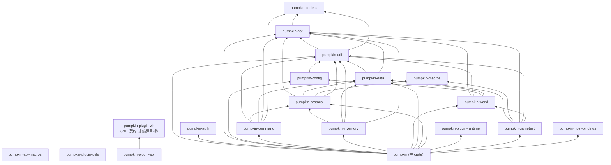
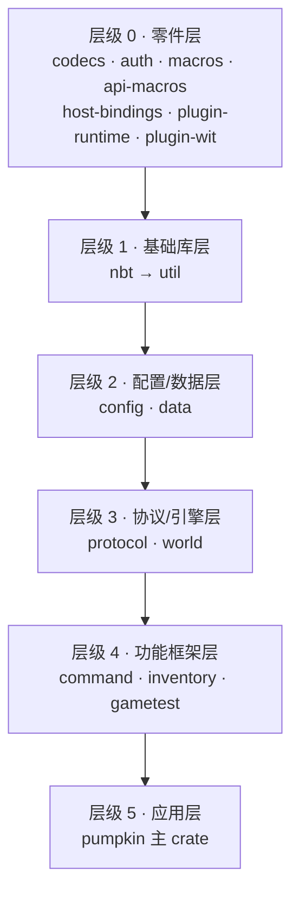
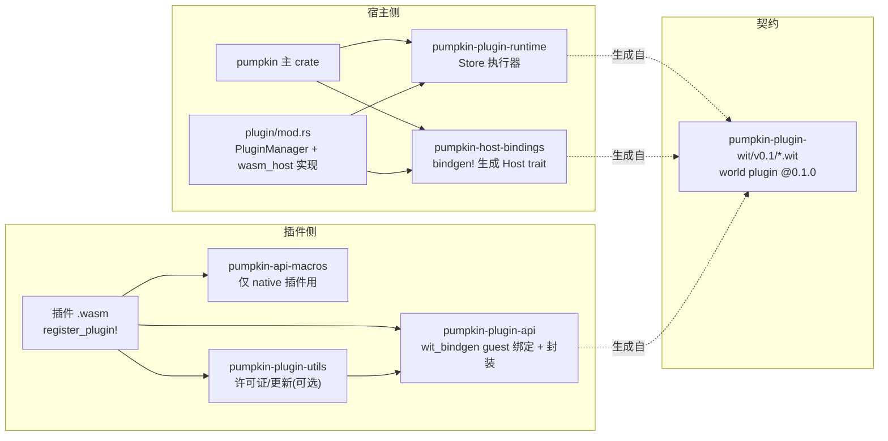

# 03 · 依赖关系

> 内部依赖取自各 crate 的 `Cargo.toml`；外部依赖取自 workspace `Cargo.toml:132-246`。分析排除 `REF/`。

## 1. workspace 内部依赖图（完整）

以下边 A → B 表示 **A 依赖 B**。数据来源：各 `crates/*/Cargo.toml` 的 `[dependencies]` 段。



### 依赖矩阵（文字版）

| crate | 内部依赖 |
|-------|---------|
| `pumpkin` | util, auth, nbt, config, command, inventory, world, data, protocol, macros, plugin-runtime, gametest, host-bindings（13 个，几乎全量） |
| `pumpkin-world` | nbt, util, config, data |
| `pumpkin-protocol` | nbt, data（+17 个 remap feature）, macros, util |
| `pumpkin-command` | util, protocol, data, nbt, codecs |
| `pumpkin-inventory` | protocol, data, util, nbt |
| `pumpkin-data` | util, nbt |
| `pumpkin-gametest` | data, macros, nbt, util, world |
| `pumpkin-config` | util |
| `pumpkin-util` | nbt, codecs |
| `pumpkin-nbt` | codecs |
| `pumpkin-plugin-api` | （仅 wit-bindgen + WIT 契约，无内部依赖） |
| `pumpkin-plugin-runtime` | （仅 wasmtime 系） |
| `pumpkin-plugin-utils` | plugin-api |
| `pumpkin-codecs` / `pumpkin-auth` / 三个宏 crate / host-bindings | 无内部依赖 |

## 2. 分层规则（依赖方向约束）



- 依赖只能自上而下（高层依赖低层），**不存在环**——例如 `pumpkin-world` 不知道 `pumpkin-protocol` 的存在，方块/区块数据结构因此与网络层解耦。
- 主 crate `pumpkin` 是唯一同时触及全部层的"组装点"。
- `pumpkin-macros` 是过程宏（编译期），被 protocol/util/主 crate 共用，不参与运行时依赖环。

## 3. 外部依赖分类（workspace 统一版本）

### 3.1 运行时与并发

| 依赖 | 用途 | 关键使用点 |
|------|------|-----------|
| tokio 1.53 | 异步运行时（网络、IO、定时） | `main.rs:48`，全部 net/ |
| tokio-util | TaskTracker / CancellationToken | `lib.rs:45-46`（任务追踪与停服信号） |
| rayon 1.12 | 数据并行（tick/生成） | `server/mod.rs:1147` 世界并行 |
| crossbeam 0.8 | SegQueue 无锁队列 | `entity/player.rs:531` 入站包队列 |
| dashmap 6.2 | 并发哈希表 | `Level.loaded_chunks`（`level.rs`） |
| arc-swap 1.9 | 无锁原子换 Arc | `Server.worlds` / `command_dispatcher` |
| futures 0.3 | 组合子 | select/Either |

### 3.2 序列化与数据格式

serde / serde_json / serde_repr / toml（配置）/ postcard（紧凑二进制）/ bytes（零拷贝包负载）。

### 3.3 加密与安全

aes+cfb8（协议流加密，`net/java/login/encryption_response.rs`）、rsa（KeyStore 1024 位，`server/key_store.rs:40`）、ecdsa+p384 与 ed25519-dalek（Bedrock OIDC 验签、插件签名、遥测签名）、sha1/sha2/md5/hmac、rustls(ring)（全树统一 TLS provider，`main.rs:54` 显式安装）。

### 3.4 网络

reqwest(rustls-no-provider)（Mojang API/OIDC/遥测）、webrtc 0.20（Bedrock NetherNet ICE）、axum+hyper（WASI http 桥）。

### 3.5 插件运行时

wasmtime（**git rev `f6b3140d` 固定**，`Cargo.toml:230`，启用 component-model/async/gc/threads）、wasmtime-wasi(-http)、wit-bindgen 0.61、wasmparser/wasm-encoder（运行时内省与编码）、libloading 0.9（native 插件 dylib 加载）。

### 3.6 其他

flate2/async-compression/lz4-java-wrc/ruzstd（区块 IO 压缩）、tracing 系（日志）、rustyline（控制台）、notify 8.2（插件热重载文件监听）、sysinfo（状态查询）、criterion（bench，pumpkin-world/nbt/util/data 四 crate 有 benches/）、phf（完美哈希静态表）、num-bigint/crypto-bigint、indexmap、itertools、lru、uuid。

### 3.7 特殊依赖说明

- **wasmtime 固定 rev**：注释（`Cargo.toml:228-229`）说明是为了等待 Component Model sync reentry 的批准实现——与 `pumpkin-plugin-runtime` 的同步重入机制强相关。
- **`rustls` ring provider 全局唯一**：`main.rs:52-54` 在任何 client 构建前安装 ring provider，与 wasmtime-wasi-http/webrtc 保持一致。

## 4. feature 依赖：pumpkin-data 的 ID 重映射体系

`pumpkin-protocol` 依赖 `pumpkin-data` 时开启 17 个 feature（`crates/pumpkin-protocol/Cargo.toml`）：

```
default, item_id_remap, entity_id_remap, sound_id_remap, particle_id_remap,
menu_id_remap, recipe_serializer_id_remap, argument_type_id_remap, attribute_id_remap,
block_entity_type_id_remap, custom_stat_id_remap, data_component_type_id_remap,
enchantment_id_remap, environment_attribute_id_remap, painting_variant_id_remap,
slot_display_id_remap, bedrock_creative, bedrock_biome
```

**设计意图**：Java 与 Bedrock 对同一种方块/物品/实体使用不同的数字 ID。协议层通过这些条件编译的重映射表，在序列化时把"统一注册 ID"翻译为目标版本 ID —— 这是双版本同服的核心机制之一。

## 5. 依赖体量与风险点

| 观察 | 说明 |
|------|------|
| 最重依赖链 | `pumpkin → pumpkin-protocol → pumpkin-data(generated 73MB) `，编译期体量大但全是静态数据（零运行时成本） |
| git 依赖 | 仅 wasmtime 三件套固定 rev；升级需同步验证插件运行时重入语义 |
| 双许可边界 | `plugin-api`/`plugin-wit` MIT/Apache，其余 GPLv3 —— 插件作者不必开源插件 |
| 循环引用的运行时处理 | `World` 持 `Weak<Server>`（`world/mod.rs:275`）避免 `Arc` 环；`PluginHostState` 持 `Weak<WasmPlugin>` 回链（`state.rs:185-197`） |
| 未用依赖防线 | CI `cargo-machete` 作业强制清查（`rust.yml` machete job） |

## 6. 插件生态内部的依赖小宇宙



契约唯一真源是 WIT 文件；宿主与插件两侧的类型都从它生成，CI 中 `sync-wit.yml` 与 `rust.yml` 的 WIT 一致性作业保证两侧不漂移。
