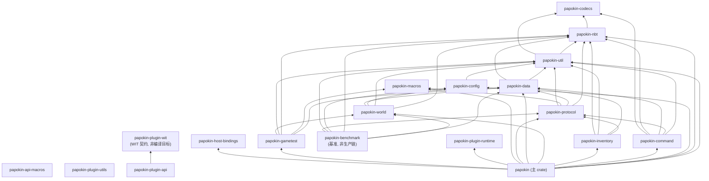
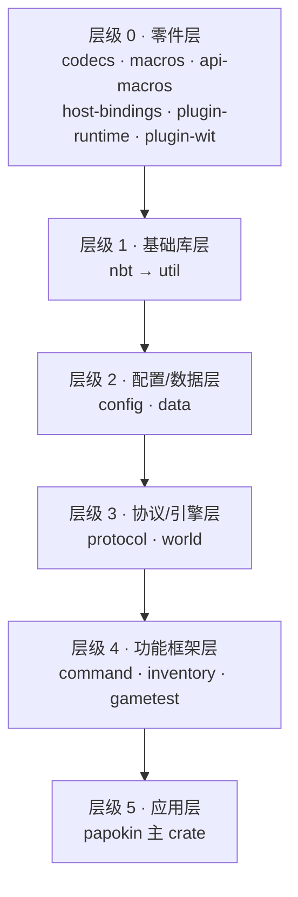
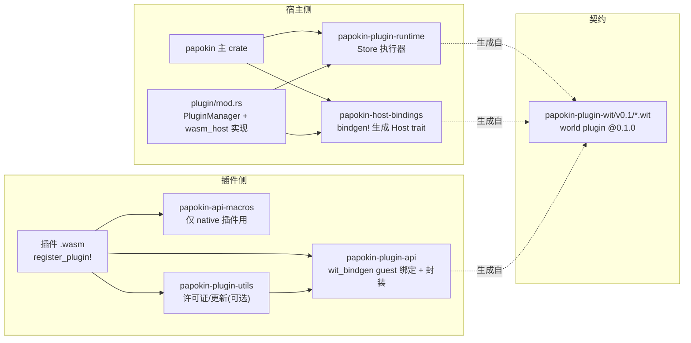

# 03 · 依赖关系

> 内部依赖取自各 crate 的 `Cargo.toml`；外部依赖取自 workspace `Cargo.toml:132-246`。分析排除 `REF/`。

## 1. workspace 内部依赖图（完整）

以下边 A → B 表示 **A 依赖 B**。数据来源：各 `crates/*/Cargo.toml` 的 `[dependencies]` 段。

```mermaid
graph BT
    %% 基础层（无内部依赖）
    CODECS["papokin-codecs"]
    MACROS["papokin-macros"]
    APIMACROS["papokin-api-macros"]
    HBIND["papokin-host-bindings"]
    WIT["papokin-plugin-wit<br/>(WIT 契约, 非编译目标)"]
    RUNTIME["papokin-plugin-runtime"]
    BENCH["papokin-benchmark<br/>(基准, 非生产链)"]
    PUTILS["papokin-plugin-utils"]

    %% 第二层
    NBT["papokin-nbt"] --> CODECS
    UTIL["papokin-util"] --> NBT & CODECS
    PAPI["papokin-plugin-api"] --> WIT
    CONFIG["papokin-config"] --> UTIL

    %% 数据层
    DATA["papokin-data"] --> UTIL & NBT

    %% 协议层
    PROTO["papokin-protocol"] --> NBT & DATA & MACROS & UTIL

    %% 引擎层
    PW["papokin-world"] --> NBT & UTIL & CONFIG & DATA

    %% 功能层
    PCMD["papokin-command"] --> UTIL & PROTO & DATA & NBT & CODECS
    INV["papokin-inventory"] --> PROTO & DATA & UTIL & NBT
    GAMETEST["papokin-gametest"] --> DATA & MACROS & NBT & UTIL & PW

    %% 主 crate
    PAPOKIN["papokin (主 crate)"] --> UTIL & NBT & CONFIG & PCMD & INV & PW & DATA & PROTO & MACROS & RUNTIME & GAMETEST & HBIND

    %% 基准 crate（性能战役双臂模型，非生产依赖链）
    BENCH --> PW & DATA & NBT & CONFIG & UTIL & PROTO
```

### 依赖矩阵（文字版）

| crate | 内部依赖 |
|-------|---------|
| `papokin` | util, nbt, config, command, inventory, world, data, protocol, macros, plugin-runtime, gametest, host-bindings（12 个，几乎全量） |
| `papokin-world` | nbt, util, config, data |
| `papokin-protocol` | nbt, data（+15 个 remap feature）, macros, util |
| `papokin-command` | util, protocol, data, nbt, codecs |
| `papokin-inventory` | protocol, data, util, nbt |
| `papokin-data` | util, nbt |
| `papokin-gametest` | data, macros, nbt, util, world |
| `papokin-config` | util |
| `papokin-util` | nbt, codecs |
| `papokin-nbt` | codecs |
| `papokin-plugin-api` | （无内部依赖；外部为 wit-bindgen/tracing/postcard/tracing-serde-structured/serde_json，即 guest 侧绑定生成、日志与序列化） |
| `papokin-plugin-runtime` | （仅 wasmtime 系） |
| `papokin-plugin-utils` | plugin-api |
| `papokin-codecs` / 两个宏 crate（`papokin-macros`、`papokin-api-macros`）/ host-bindings | 无内部依赖 |
| `papokin-benchmark`（workspace 第 20 成员） | world, data, nbt, config, util, protocol（+ arc-swap/tokio/sysinfo 外部；双臂基准模型，非生产链） |

## 2. 分层规则（依赖方向约束）

```mermaid
graph TD
    L0["层级 0 · 零件层<br/>codecs · macros · api-macros<br/>host-bindings · plugin-runtime · plugin-wit"]
    L1["层级 1 · 基础库层<br/>nbt → util"]
    L2["层级 2 · 配置/数据层<br/>config · data"]
    L3["层级 3 · 协议/引擎层<br/>protocol · world"]
    L4["层级 4 · 功能框架层<br/>command · inventory · gametest"]
    L5["层级 5 · 应用层<br/>papokin 主 crate"]
    L0 --> L1 --> L2 --> L3 --> L4 --> L5
```

- 依赖只能自上而下（高层依赖低层），**不存在环**——例如 `papokin-world` 不知道 `papokin-protocol` 的存在，方块/区块数据结构因此与网络层解耦。
- 主 crate `papokin` 是唯一同时触及全部层的"组装点"。
- `papokin-macros` 是过程宏（编译期），被 protocol/util/主 crate 共用，不参与运行时依赖环。

## 3. 外部依赖分类（workspace 统一版本）

### 3.1 运行时与并发

| 依赖 | 用途 | 关键使用点 |
|------|------|-----------|
| tokio 1.53 | 异步运行时（网络、IO、定时） | `main.rs:48`，全部 net/ |
| tokio-util | TaskTracker / CancellationToken | `lib.rs:45-46`（任务追踪与停服信号） |
| rayon 1.12 | 数据并行（tick/生成） | `main.rs:55-72` 全局池限容（默认 `(核数/4).clamp(4, 8)`，`PAPOKIN_RAYON_THREADS` 可调），`server/mod.rs` 世界并行 |
| crossbeam 0.8 | SegQueue 无锁队列 | `entity/player.rs:531` 入站包队列 |
| dashmap 6.2 | 并发哈希表 | `Level.loaded_chunks`（`level.rs`） |
| arc-swap 1.9 | 无锁原子换 Arc | `Server.worlds` / `command_dispatcher` |
| futures 0.3 | 组合子 | select/Either |

### 3.2 序列化与数据格式

serde / serde_json / serde_repr / toml（配置）/ postcard（紧凑二进制）/ bytes（零拷贝包负载）。

### 3.3 加密与安全

aes+cfb8（协议流加密，`net/java/login/encryption_response.rs`）、rsa（KeyStore 1024 位，`server/key_store.rs:40`）、ed25519-dalek（插件签名、遥测签名）、sha1/sha2/md5/hmac、rustls(ring)（全树统一 TLS provider，`main.rs:54` 显式安装）。

### 3.4 网络

reqwest(rustls-no-provider)（Mojang API/遥测）、axum+hyper（WASI http 桥）。

### 3.5 插件运行时

wasmtime（**git rev `f6b3140d` 固定**，`Cargo.toml:230`，启用 component-model/async/gc/threads）、wasmtime-wasi(-http)、wit-bindgen 0.61、wasmparser/wasm-encoder（运行时内省与编码）、libloading 0.9（native 插件 dylib 加载）。

### 3.6 其他

flate2/async-compression/lz4-java-wrc/ruzstd（区块 IO 压缩）、tracing 系（日志）、rustyline（控制台）、notify 8.2（插件热重载文件监听）、sysinfo（状态查询）、criterion（bench，papokin-world/nbt/util/data 四 crate 有 benches/）、phf（完美哈希静态表）、num-bigint/crypto-bigint、indexmap、itertools、lru、uuid。

### 3.7 特殊依赖说明

- **wasmtime 固定 rev**：注释（`Cargo.toml:228-229`）说明是为了等待 Component Model sync reentry 的批准实现——与 `papokin-plugin-runtime` 的同步重入机制强相关。
- **`rustls` ring provider 全局唯一**：`main.rs:52-54` 在任何 client 构建前安装 ring provider，与 wasmtime-wasi-http 保持一致。

## 4. feature 依赖：papokin-data 的 ID 重映射体系

`papokin-protocol` 依赖 `papokin-data` 时开启 15 个 `*_id_remap` feature（如 `item_id_remap`、`entity_id_remap`、`sound_id_remap` 等，`crates/papokin-protocol/Cargo.toml`），对应 `generated/` 下的条件编译重映射表（另有 `sync_id_remap` 模块承载登录注册表同步的重映射）。

**用途：存档版本重映射**。这些表服务于 1.21.11 存档重写服务——读写历史版本（26.3）存档与区块时，把方块状态、物品、实体等旧数字 ID 翻译为当前版本 ID，并处理登录注册表同步表的版本漂移，详见 [09-存档系统重写实现记录.md](09-存档系统重写实现记录.md)。

## 5. 依赖体量与风险点

| 观察 | 说明 |
|------|------|
| 最重依赖链 | `papokin → papokin-protocol → papokin-data(generated 67MB)`，编译期体量大但全是静态数据（零运行时成本） |
| git 依赖 | 仅 wasmtime 三件套固定 rev；升级需同步验证插件运行时重入语义 |
| 双许可边界 | `plugin-api`/`plugin-wit` MIT/Apache，其余 GPLv3 —— 插件作者不必开源插件 |
| 循环引用的运行时处理 | `World` 持 `Weak<Server>`（`world/mod.rs:275`）避免 `Arc` 环；`PluginHostState` 持 `Weak<WasmPlugin>` 回链（`state.rs:185-197`） |
| 未用依赖防线 | CI `cargo-machete` 作业强制清查（`rust.yml` machete job） |

## 6. 插件生态内部的依赖小宇宙

```mermaid
graph LR
    subgraph HOST["宿主侧"]
        PAPOKIN2["papokin 主 crate"]
        HB["papokin-host-bindings<br/>bindgen! 生成 Host trait"]
        RT["papokin-plugin-runtime<br/>Store 执行器"]
        PM["plugin/mod.rs<br/>PluginManager + wasm_host 实现"]
    end
    subgraph CONTRACT["契约"]
        WITF["papokin-plugin-wit/v0.1/*.wit<br/>world plugin @0.1.0"]
    end
    subgraph GUEST["插件侧"]
        API["papokin-plugin-api<br/>wit_bindgen guest 绑定 + 封装"]
        PLUGIN["插件 .wasm<br/>register_plugin!"]
        AM["papokin-api-macros<br/>仅 native 插件用"]
        PU["papokin-plugin-utils<br/>许可证/更新(可选)"]
    end
    PAPOKIN2 --> RT & HB
    RT & HB -. "生成自" .-> WITF
    PM --> RT & HB
    API -. "生成自" .-> WITF
    PLUGIN --> API
    PLUGIN --> AM
    PLUGIN --> PU
    PU --> API
```

契约唯一真源是 WIT 文件；宿主与插件两侧的类型都从它生成，CI 中 `sync-wit.yml` 与 `rust.yml` 的 WIT 一致性作业保证两侧不漂移。
