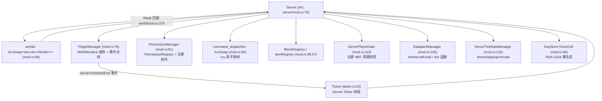
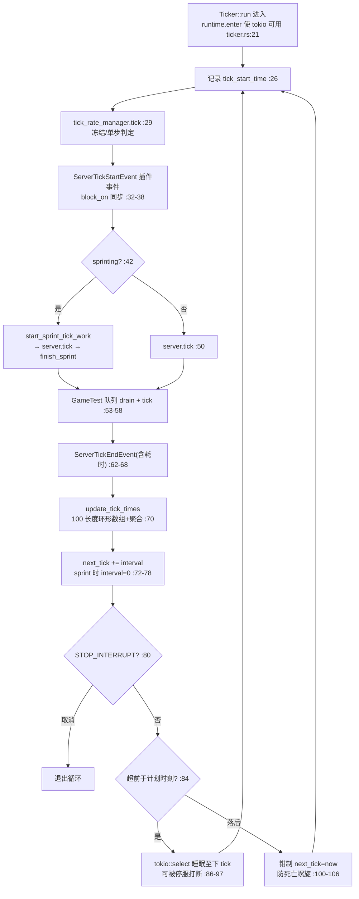
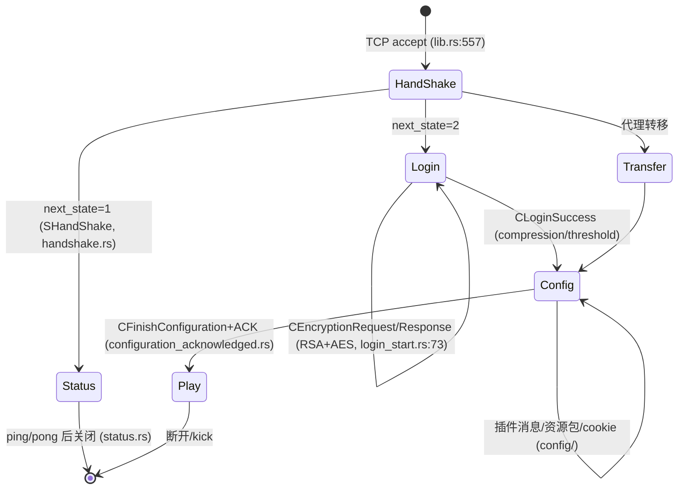
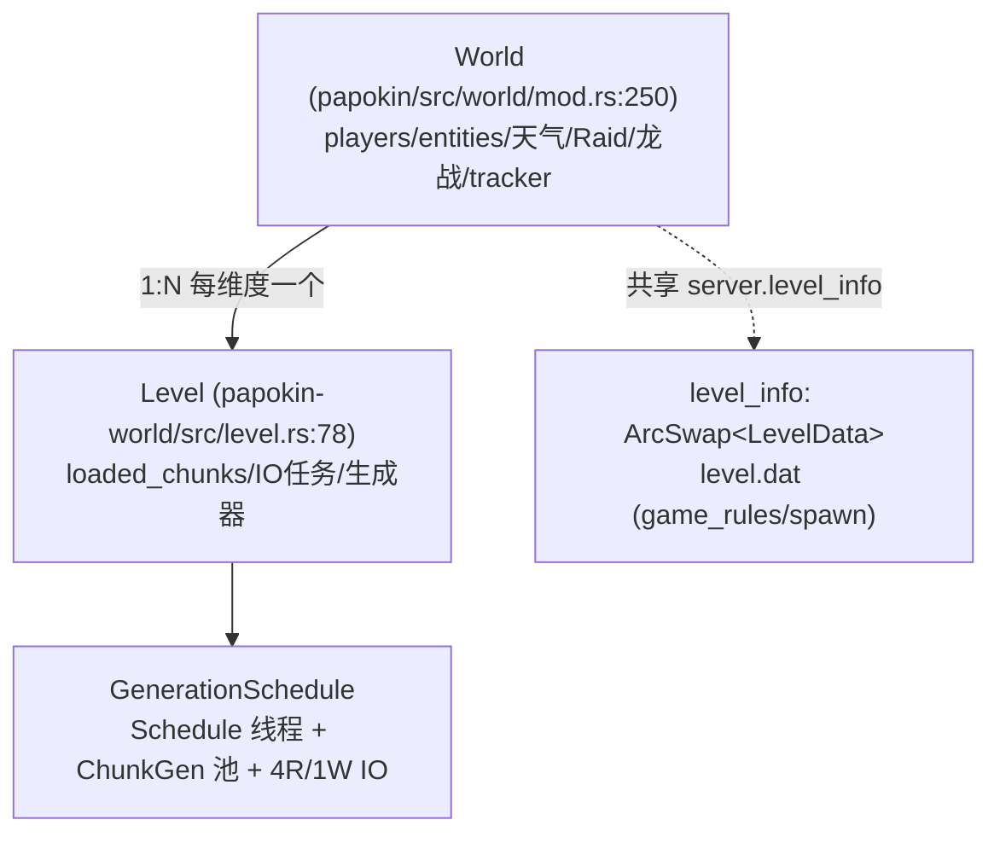
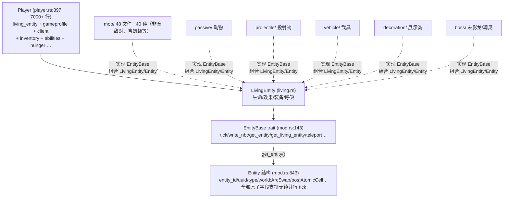
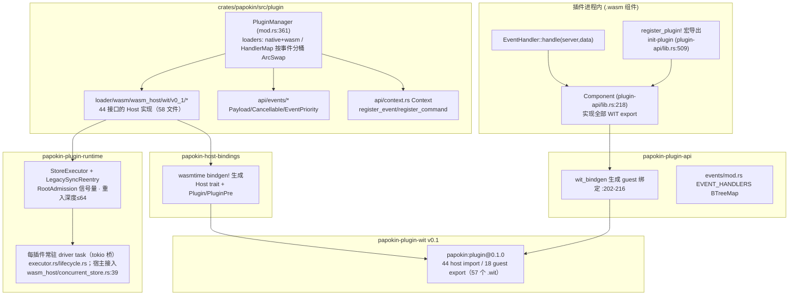

# 04 · 模块分析（逐模块深度剖析 + 结构图）

> 每个模块给出：职责、关键类型（含文件:行号）、内部结构图。采样策略：大目录读代表文件 + 全量目录扫描。

## 4.1 服务器核心 —— `crates/papokin/src/server/`

**职责**：全局单例 `Server`（`server/mod.rs:70-155`，直接构造为 `Arc<Self>`），聚合 30+ 管理器字段，是所有子系统的共享根。

### Server 关键字段分组

| 分组 | 字段（`server/mod.rs` 行号） |
|------|------------------------------|
| 配置 | `basic_config`/`advanced_config`/`telemetry_config`(71-73) |
| 数据存档 | `data: VanillaData`(75)、`player_data_storage`(119)、`advancement_manager`(128) |
| 插件/权限 | `plugin_manager`(78)、`permission_manager`(81)、`task_scheduler`(146) |
| 网络/加密 | `key_store: OnceCell`(84)、`listing`/`branding` 缓存(89-91) |
| 命令 | `command_dispatcher: ArcSwap<CommandDispatcher>`(93) —— 支持插件装卸时**原子换树** |
| 世界 | `worlds: ArcSwap<Vec<Arc<World>>>`(99)、`dimensions`(101)、`level_info`(153) |
| 注册表 | `block_registry`(95)、`item_registry`(97)、`recipe_manager`(104)、`datapack_manager`(105)、`enchantment_manager`(106) |
| tick 统计 | `tick_rate_manager`(132)、`tick_times_nanos[100]`(134)、`tick_count`(138) |
| 其他 | `bossbars`(113)、`map_manager`(115)、`mojang_public_keys`(111)、`tasks: TaskTracker`(149)、`runtime: tokio Handle`(150) |

### 管理器协作图


```mermaid
graph TD
    SERVER["Server (Arc, server/mod.rs:70)"]
    SERVER --> WORLDS["worlds: ArcSwap&lt;Vec&lt;Arc&lt;World&gt;&gt;&gt; (mod.rs:99)"]
    SERVER --> PM["PluginManager (mod.rs:78)<br/>WASM/native 插件 + 事件总线"]
    SERVER --> PERM["PermissionManager (mod.rs:81)<br/>PermissionRegistry + 玩家附件"]
    SERVER --> CD["command_dispatcher: ArcSwap (mod.rs:93)<br/>rcu 原子换树"]
    SERVER --> BR["BlockRegistry / ItemRegistry (mod.rs:95,97)"]
    SERVER --> PDS["ServerPlayerData (mod.rs:119)<br/>玩家 NBT 周期快照"]
    SERVER --> DPM["DatapackManager (mod.rs:105)<br/>#minecraft:load / tick 函数"]
    SERVER --> TRM["ServerTickRateManager (mod.rs:132)<br/>freeze/step/sprint/rate"]
    SERVER --> KS["KeyStore OnceCell (mod.rs:84)<br/>RSA-1024 懒生成"]
    WORLDS -->|"Weak 回链 world/mod.rs:275"| SERVER
    PM -->|"ServerTickStart/End 事件"| TICKER["Ticker (ticker.rs:20)<br/>Server-Ticker 线程"]
    TICKER --> SERVER
```

### Server::new() 初始化序列（`server/mod.rs:160-440`）

1. 权限管理器 → 默认命令分发器(168-171) → level.dat 读取/新建(181-227) → 玩家存档/成就/白名单/TPS(240-252) → 维度列表(254-263) → 结构体组装(279-325) → `Arc::new`(326)
2. 后台任务：RSA KeyStore 生成、Mojang 公钥拉取(330-385)
3. 按维度 `World::load` + 传送门连接(387-407) → 触发 WorldInit/WorldLoad 插件事件(409-423) → 数据包加载 + `#minecraft:load`(429-437)

## 4.2 游戏循环 —— `server/ticker.rs`

**职责**：独立 OS 线程 `Server-Ticker`（`lib.rs:333-344` spawn），默认 20 TPS（50ms/tick，`papokin-config/src/lib.rs:237`），驱动整个模拟。

### tick 主循环结构


```mermaid
flowchart TD
    A["Ticker::run 进入<br/>runtime.enter 使 tokio 可用 ticker.rs:21"] --> B["记录 tick_start_time :26"]
    B --> C["tick_rate_manager.tick :29<br/>冻结/单步判定"]
    C --> D["ServerTickStartEvent 插件事件<br/>block_on 同步 :32-38"]
    D --> E{"sprinting? :42"}
    E -->|是| F["start_sprint_tick_work<br/>→ server.tick → finish_sprint"]
    E -->|否| G["server.tick :50"]
    F & G --> H["GameTest 队列 drain + tick :53-58"]
    H --> I["ServerTickEndEvent(含耗时) :62-68"]
    I --> J["update_tick_times<br/>100 长度环形数组+聚合 :70"]
    J --> K["next_tick += interval<br/>sprint 时 interval=0 :72-78"]
    K --> L{"STOP_INTERRUPT? :80"}
    L -->|取消| EXIT["退出循环"]
    L -->|否| M{"超前于计划时刻? :84"}
    M -->|是| N["tokio::select 睡眠至下 tick<br/>可被停服打断 :86-97"]
    M -->|落后| O["钳制 next_tick=now<br/>防死亡螺旋 :100-106"]
    N & O --> B
```

### Server::tick → World::tick 展开顺序（`server/mod.rs:1153-1206` → `world/mod.rs:1287-1520`）

```
Server::tick (server/mod.rs:1153)
├─ 冻结分支：/tick freeze 时跳过世界逻辑，只跑 tick_players_and_network
│  （玩家 tick、保活、方块更新刷送，:1154-1159 → :1164）
└─ tick_worlds (:1182)
   ├─ ① datapack_manager.execute_function("#minecraft:tick")   :1183-1188
   ├─ ② task_scheduler.tick —— 弹出到期 WASM 插件任务           :1190
   ├─ ③ scheduled_functions.tick —— /schedule 的 mcfunction    :1191
   ├─ ④ worlds.par_iter() —— rayon 并行各 World::tick          :1199
   │   World::tick (world/mod.rs:1287) 顺序：
   │   ├─ flush_block_updates —— 按区块段打包 CBlockUpdate/CMultiBlockUpdate 广播 :1292
   │   ├─ flush_synced_block_events —— 红石同步方块事件         :1293
   │   ├─ update_active_chunks —— simulation_distance 更新     :1294
   │   ├─ tick_environment —— 时间→内存清理/自动保存→天气→跳夜   :1295
   │   ├─ Raids::tick（锁内换出→tick→合并回写）                 :1296-1314
   │   ├─ tick_chunks (world/mod.rs:1731)
   │   │   ├─ get_tick_data 收集三类计划 tick；单刻方块/流体刻上限
   │   │   │   MAX_SCHEDULED_TICKS_PER_FRAME=65536（对齐原版），
   │   │   │   溢出按原优先级 0 延迟顺延下一刻                  :1735-1764
   │   │   ├─ 方块计划 tick chunks(32) → on_scheduled_tick      :1785  ← 红石核心
   │   │   ├─ 流体计划 tick chunks(32)                          :1811
   │   │   ├─ 随机 tick chunks(32) → random_tick                :1858
   │   │   ├─ 刷怪列表计算 + spawning chunks(32)                :1914
   │   │   └─ inhabited_time += 1（批 1024）                    :1929
   │   ├─ players tick（含入站包消费），panic 隔离踢当事人       :1322-1366
   │   ├─ 实体按活跃已加载区块过滤后 chunks(16) tick + 玩家碰撞，
   │   │   panic 隔离移除坏实体                                 :1368-1451
   │   ├─ entity_tracker.update_all —— 可见性重算与广播         :1454
   │   ├─ 方块实体 chunks(16) tick + flush_comparator_updates   :1472-1493
   │   ├─ chunk_loading.send_change —— 通知区块调度线程         :1496-1500
   │   └─ DragonFight::tick                                     :1502
   └─ ⑤ player_data_storage.tick —— 周期保存玩家数据           :1205
```

**0.3.11 并行模型修订（小集合串行快路径）**：rayon 全局池默认限容 `(核数/4).clamp(4, 8)`（`main.rs:55-72`，`PAPOKIN_RAYON_THREADS` 可调）之后，世界 tick 内所有 fork-join 点都带"小集合直接串行"分支——唤醒整个 Rayon 池的固定开销在小集合上远超并行收益：玩家 ≤2（:1361）、实体过滤 ≤256（:1393）、实体/方块实体 tick ≤2×16（:1445/:1481）、方块/流体/随机/刷怪 ≤2×32（:1785/:1811/:1858/:1914）、inhabited_time ≤2×1024（:1929）。刷怪批大小同步由 8 提至 32（`SPAWN_BATCH_SIZE`，:1733）。

**tick panic 隔离**：玩家 tick 与实体 tick 均包在 `TickIsolationGuard` + `catch_unwind` 内（:1340-1357 / :1406-1441）——坏包或插件缺陷只踢当事人/移除坏实体，不再沿 rayon 工作线程传播触发全服关停；隔离作用域查询见 `world::in_tick_isolation()`（`world/mod.rs:6893`）。

## 4.3 网络层 —— `crates/papokin/src/net/` + `papokin-protocol`

**职责**：Java 版连接接入、登录状态机、包编解码、限速、keep-alive、RCON/Query/LAN。

### 连接状态机（`papokin-protocol/src/lib.rs:55-62` + `net/java/pending.rs:245-259`）


```mermaid
stateDiagram-v2
    [*] --> HandShake: TCP accept (lib.rs:557)
    HandShake --> Status: next_state=1 (SHandShake, handshake.rs)
    HandShake --> Login: next_state=2
    HandShake --> Transfer: 代理转移
    Status --> [*]: ping/pong 后关闭 (status.rs)
    Login --> Login: CEncryptionRequest/Response (RSA+AES, login_start.rs:73)
    Login --> Config: CLoginSuccess (compression/threshold)
    Transfer --> Config
    Config --> Config: 插件消息/资源包/cookie (config/)
    Config --> Play: CFinishConfiguration+ACK (configuration_acknowledged.rs)
    Play --> [*]: 断开/kick
```

### Java 登录序列（`pending.rs:205-243` handle_login_sequence，30s 空闲超时 :55）

1. `get_packet()`（select: close_token / 30s 超时 / 读包，`pending.rs:138-168`）
2. `packet_limiter.check_packet()` 超限即踢（:207-224）
3. 按 `connection_state` 分派 `handle_*_packet`（:250-258）
4. 认证：`authenticate()` → Mojang `hasJoined?username&serverId`（`authentication.rs:90-161`），serverId = 带符号 SHA-1 摘要（`server/key_store.rs:74-86`）；可选代理转发（Velocity/BungeeCord/Vine，`net/proxy/`）
5. `PacketHandlerResult::ReadyToPlay(profile, config)` → 主循环建 `JavaClient` + `add_player`（`lib.rs:591-614`）

### 运行期包处理管线（Play 阶段）


```mermaid
flowchart LR
    subgraph IN["入站 (每玩家)"]
        A1["TCP 读半<br/>BufReader"] --> A2["TCPNetworkDecoder<br/>解帧+解压+解密"]
        A2 --> A3["RawPacket id+payload"]
        A3 --> A4["progress_player_packets 循环<br/>net/java/mod.rs:275<br/>keep-alive select"]
        A4 --> A5["player.inbound_packets<br/>SegQueue push :368"]
    end
    subgraph TICK["tick 线程 (rayon)"]
        B1["Player::tick :2564"] --> B2["process_inbound_packets :2490<br/>≤64 包/tick"]
        B2 --> B3["JavaClient::handle_play_packet<br/>net/java/mod.rs:879"]
        B3 --> B4["PacketReceivedEvent 插件钩子<br/>可取消"]
        B4 --> B5["match packet_id ==<br/>Sxxx::to_id(version)"]
        B5 --> B6["handle_xxx 处理器<br/>net/java/play/*.rs (61 个)"]
    end
    subgraph OUT["出站 (每玩家专任务)"]
        C1["send_packet / enqueue_client_packet<br/>&lt;P: ClientPacket&gt;<br/>net/java/mod.rs:785,791"] --> C2["unbounded 通道<br/>普通+高优先级双队列<br/>net/java/mod.rs:102-108"]
        C2 --> C3["start_outgoing_packet_task :742<br/>tokio 专任务"]
        C3 --> C4["TCPNetworkEncoder<br/>压缩+加密+写帧"]
        C4 --> C5["TCP 写半"]
    end
    A5 -.-> B1
    B6 -.-> C1
```

### 协议库内部（`papokin-protocol/src/`）

| 目录 | 内容 |
|------|------|
| `java/client/` | 客户端→服务器方向的包（login/config/play/status/dialog） |
| `java/server/` | 服务器→客户端方向的包 |
| `codec/` | var_int/var_long/var_uint/var_ulong/little_endian/bitset/data_component/uuid… |
| `ser/` `serial/` | 读取/写入基础设施 |
| 多版本支持 | `#[packet(id)]`/`#[java_packet]` 宏挂多版本 ID（`papokin-macros/src/lib.rs:274,296`）；`PacketRead/PacketWrite` derive（:567,637） |

## 4.4 世界引擎 —— `crates/papokin-world/`

**职责**：区块内存表示、加载/保存管线、地形生成、光照、POI、level.dat。主 crate 的 `World` 是编排壳，本 crate 是数据引擎。

### Level（`level.rs:78`）关键字段

| 字段 | 作用 |
|------|------|
| `loaded_chunks: Arc<DashMap<Vector2<i32>, SyncChunk>>` | 已加载区块表 |
| `world_gen: ArcSwap<WorldGenerator>` | 生成器（可换 flat/vanilla） |
| `chunk_saver` | 脏区块收集与落盘 |
| `light_engine: DynamicLightEngine` | 光照 |
| `level_channel: Arc<LevelChannel>` | 与区块调度线程通信（保存/卸载通知） |
| `chunk_system_tasks: TaskTracker` + 4 读 + 1 写 IO 任务（`schedule.rs:120-133`，`level.rs:301`） | chunk IO |
| `should_save/should_unload/autosave_ticks` | 自动保存状态机 |

### 区块生成阶段流水线（`chunk_system/chunk_state.rs:22-42` StagedChunkEnum）


```mermaid
flowchart LR
    S0["None"] --> S1["Empty<br/>结构起点/引用占位"]
    S1 --> S2["Biomes<br/>群系填充"]
    S2 --> S3["StructureStart"]
    S3 --> S4["StructureReferences"]
    S4 --> S5["Noise<br/>噪声地形"]
    S5 --> S6["Surface<br/>表层规则"]
    S6 --> S7["Carvers<br/>洞穴雕刻"]
    S7 --> S8["Features<br/>特性+结构放置"]
    S8 --> S9["Lighting<br/>光照计算"]
    S9 --> S10["Spawn<br/>初始实体"]
    S10 --> S11["Full<br/>完成"]
```

对应 `VanillaGenerator`（`generation/generator/mod.rs:123`）各阶段函数与 `CustomChunkGenerator` trait（:34）；`FlatGenerator`（flat.rs）跳过噪声直接铺层。生成经由 DAG 调度器（`chunk_system/dag.rs` + `schedule.rs` 的 `Schedule` 专用线程 + `ChunkGen-{i}` 专用 rayon 池 `(cpus/2).clamp(2,16)` 线程，`schedule.rs:135-143`）按依赖推进，特性阶段需要 3×3 邻接区块（`generator/mod.rs:71`）。

### 区块加载调用链（玩家视距驱动）

```
Player 移动跨区块
└─ chunker::update_position (world/chunker.rs:43)
   ├─ 发 CCenterChunk / CNetworkChunkPublisherUpdate :60-75
   ├─ Cylindrical::changed_chunks 计算加载/卸载差集 :76-79
   ├─ 按视距/模拟距离计算 ticket 等级 :95-103
   └─ Level 标记 watched/unwatched (level.rs:440-480)
      └─ GenerationSchedule DAG → 读 IO 任务(4) / ChunkGen 池 → StagedChunk 推进 → Full
         └─ chunk_listener 回调 → ChunkSender 批量下发 (net/chunk_sender.rs)
```

### 保存格式（`chunk/format/`）

`anvil.rs`（.mca，zlib/gzip/lz4 可配）、`linear.rs`（Linear 地区文件）、`pump.rs`（自研格式）三种 `ChunkSerializer`；实体区块独立存 `entities/` 目录且**按快照整写**（最近 commit `04d0276`）。

### 主 crate World 与 Level 的关系


```mermaid
graph TD
    W["World (papokin/src/world/mod.rs:250)<br/>players/entities/天气/Raid/龙战/tracker"]
    L["Level (papokin-world/src/level.rs:78)<br/>loaded_chunks/IO任务/生成器"]
    LI["level_info: ArcSwap&lt;LevelData&gt;<br/>level.dat (game_rules/spawn)"]
    GEN["GenerationSchedule<br/>Schedule 线程 + ChunkGen 池 + 4R/1W IO"]
    W -->|"1:N 每维度一个"| L
    L --> GEN
    W -.->|"共享 server.level_info"| LI
```

## 4.5 实体体系 —— `crates/papokin/src/entity/`（292 文件）

### 类型层次（组合 + trait，非继承）


```mermaid
graph TD
    EB["EntityBase trait (mod.rs:143)<br/>tick/write_nbt/get_entity/get_living_entity/teleport…"]
    ENT["Entity 结构 (mod.rs:843)<br/>entity_id/uuid/type/world:ArcSwap/pos:AtomicCell…<br/>全部原子字段支持无锁并行 tick"]
    LE["LivingEntity (living.rs)<br/>生命/效果/装备/呼吸"]
    PL["Player (player.rs:397, 7000+ 行)<br/>living_entity + gameprofile + client<br/>+ inventory + abilities + hunger …"]
    MOB["mob/ 48 文件 ~40 种（非全敌对，含蝙蝠等）"]
    PAS["passive/ 动物"]
    PROJ["projectile/ 投射物"]
    VEH["vehicle/ 载具"]
    DEC["decoration/ 展示类"]
    BOSS["boss/ 末影龙/凋灵"]
    EB -.->|"get_entity()"| ENT
    LE -.-> EB
    PL --> LE
    MOB & PAS & PROJ & VEH & DEC & BOSS -.->|"实现 EntityBase<br/>组合 LivingEntity/Entity"| LE
```

- 存储：`World.entities: ArcSwap<Vec<Arc<dyn EntityBase>>>`（`world/mod.rs:260`），tick 时过滤活跃区块后 `chunks(16)`（`world/mod.rs:1368-1451`，含 panic 隔离与小集合串行快路径）。
- 持久化：`EntityBase::write_nbt/read_nbt_non_mut`（`mod.rs:144-172`）写入实体区块。
- 同步：`synched_entity_data.rs` 维护元数据差异集（按 `tracked_data` 的 TrackedId 记录脏项）；`entity_tracker.rs:31 TrackedEntity` 按玩家配对发送 spawn/destroy/移动增量（`add_pairing/update_players/broadcast_removed`）。

### AI 框架（`entity/ai/`，双轨制）

| 子体系 | 文件 | 说明 |
|--------|------|------|
| **Goal 体系**（旧） | `goal/` 55 文件 + `goal_selector.rs` | 优先级目标选择器：melee_attack/break_door/breed/flee_sun/avoid_entity… 每个目标一个文件 |
| **Brain 体系**（新，commit `6a2d833`） | `brain/` | 原版风格：`memory/`（类型化记忆+编解码）、`behavior/`（OneShot/Gate/Timed/ShufflingList 组合子）、`sensing/`（感知器）、`activity.rs`（活动调度） |
| 运动控制 | `control/` | move_control/look_control/jump_control/游翔变体 |
| 村民/掠夺者 AI | `mob/piglin_ai.rs`、`mob/patrol.rs` 等 | 特化行为 |

## 4.6 插件系统 —— 五件套 + 宿主集成

### 分层架构图


```mermaid
graph TB
    subgraph GUEST["插件进程内 (.wasm 组件)"]
        REG["register_plugin! 宏导出<br/>init-plugin (plugin-api/lib.rs:509)"]
        EH["EventHandler::handle(server,data)"]
        CGUEST["Component (plugin-api/lib.rs:218)<br/>实现全部 WIT export"]
    end
    subgraph SDK["papokin-plugin-api"]
        GB["wit_bindgen 生成 guest 绑定 :202-216"]
        EVS["events/mod.rs EVENT_HANDLERS BTreeMap"]
    end
    subgraph CONTRACT["papokin-plugin-wit v0.1"]
        WITW["papokin:plugin@0.1.0<br/>44 host import / 18 guest export（57 个 .wit）"]
    end
    subgraph HOSTIMPL["crates/papokin/src/plugin"]
        PM2["PluginManager (mod.rs:361)<br/>loaders: native+wasm / HandlerMap 按事件分桶 ArcSwap"]
        WH["loader/wasm/wasm_host/wit/v0_1/*<br/>44 接口的 Host 实现（58 文件）"]
        EVENTS["api/events/*<br/>Payload/Cancellable/EventPriority"]
        CTX["api/context.rs Context<br/>register_event/register_command"]
    end
    subgraph RT["papokin-plugin-runtime"]
        EXE["StoreExecutor + LegacySyncReentry<br/>RootAdmission 信号量 · 重入深度≤64"]
        DRV["每插件常驻 driver task（tokio 桥）<br/>executor.rs/lifecycle.rs；宿主接入<br/>wasm_host/concurrent_store.rs:39"]
    end
    subgraph HB2["papokin-host-bindings"]
        BG["wasmtime bindgen! 生成<br/>Host trait + Plugin/PluginPre"]
    end
    REG & EH --> CGUEST --> GB --> WITW
    PM2 --> WH --> BG --> WITW
    WH --> EXE --> DRV
    PM2 --> EVENTS & CTX
```

### 生命周期与事件流（要点）

- **加载**：`PluginManager::load_plugins`（`plugin/mod.rs:994`）→ 拓扑排序依赖（:511）→ 权限审批（交互询问 :571、配置/缓存/询问裁决 :1198-1214）→ `on_load` 前**按权限配置 WASI 沙箱**（socket 策略/DNS/环境变量/预开目录/内存上限，`loader/wasm/wasm_host/mod.rs:86,162,453-471`）
- **事件分发**：`fire()`（mod.rs:1968，零 handler 早退；blocking 段 `fire_blocking` :2005）按事件名取 handler 列表（已注册时排好序，派发零排序零分配）→ **按 [blocking, 非 blocking] 两段串行**（blocking 可改事件），每个处理器重新读取取消标志（中途取消对后续 `ignoreCancelled` 可见，Bukkit 语义）→ WASM handler 经 `call_guest(handle-event)` 进出，事件数据（含 cancelled）双向同步
- **热重载**：`notify` watcher 监听 `./plugins`，`.wasm` 变更（大小写不敏感）→ 500ms 去抖按路径合并 → 卸载旧 → 加载新（mod.rs:368-466）
- **卸载**：注销 handler/命令（命令树整体 rcu 重发）→ 回收插件命名空间权限节点（`unregister_prefix`，跳过 toml 预声明，轮次 25）→ 恢复区块生成器/移除结构模板 → `on_unload` → Store shutdown 排空
- **安全**：ed25519 签名自定义 section（`signature.rs`）、`allow_unsigned` 开关、跨插件同步调用走共享重入链防死锁（`chain.rs` FIFO）

## 4.7 命令系统 —— `papokin-command` + `command/`

**架构**：自研 Brigadier 克隆。`CommandDispatcher<S>`（`node/dispatcher.rs:71`，顶层 `dispatcher.rs` 仅为再导出）持 `Tree<S>`（`node/tree.rs:79`）；节点四类 Root/Command/Literal/Argument（`node/attached.rs`）；`ArgumentType` 类型擦除为 `AnyArgumentType`；`CommandContext.get_argument::<T>()` 下取参数。

### 命令执行调用链（控制台/聊天/RCON/命令方块同源）

```
输入 "/give @p diamond 64"
└─ CommandDispatcher::handle_command (node/dispatcher.rs:555)
   ├─ is_disabled 检查（配置禁用 + 插件停用）
   ├─ parse → parse_nodes 递归
   │   ├─ get_relevant_nodes 字面量优先
   │   ├─ can_use 权限谓词（无权限节点对补全也不可见）node/tree.rs:285
   │   ├─ parse_literal / argument_type.parse_with_source
   │   └─ redirect(/execute) 递归 + 多候选择优
   └─ execute → ContextChain::try_flatten → run_executable
       └─ GiveExecutor::execute (commands/give.rs:22)
          └─ send_feedback / get_argument::<ItemArg>
```

**内置命令 87 个**（`command/commands/`，注册于 `commands/mod.rs`）：管理（ban/op/whitelist…）、传送（tp/spawnpoint/spreadplayers…）、世界（setblock/fill/clone/place/forceload…）、计分板、函数（execute/function/schedule/data）、社交（msg/list/help）等。每个命令文件统一模式：`const PERMISSION` + `register(dispatcher, registry)`。

**权限**：`papokin-util/src/permission.rs` —— `PermissionLvl`(0-4) / `Permission` 树（node+children 继承）/ `PermissionRegistry`(DashMap) / `PermissionManager`（玩家附件→通配→注册表 default→OP 等级，:330-392）。`Player::has_permission`（`player.rs:6184`）还会触发 `PlayerPermissionCheckEvent` 供插件改写。

## 4.8 方块 / 物品 / 附魔 —— `block/` `item/` `enchantment/`

- **BlockRegistry**：`BlockMetadata` trait + `#[pumpkin_block]` 宏把行为结构体绑定到 papokin-data 的方块 ID 集；`blocks/` 按域分文件（红石全套、门、床、容器…），`on_scheduled_tick`/`on_place`/`on_interact` 等钩子由 World tick 与交互路径调用；`entities/` 方块实体（熔炉/漏斗/命令方块…）实现 `BlockEntity::tick`。
- **ItemRegistry**：`ItemMetadata`/`ItemBehaviour`（use/consume 钩子），`items/` 每类物品行为。
- **EnchantmentManager + effects/**：自定义附魔效果应用，数据本体来自 `papokin_data::enchantment`。

## 4.9 配置 —— `papokin-config`

`PapokinConfig`（`lib.rs:75-87`）= `basic`(flatten papokin.toml 顶层) + `advanced` + `telemetry`：

```
advanced:
├─ logging (level/color/timestamp/file/Gzip滚动)
├─ resource_pack (java{enabled,url,sha1,force})
├─ world (chunk{anvil 压缩/写模式}, lighting, autosave_ticks)
├─ networking
│   ├─ java (address/online_mode/encryption/view_distance/compression/
│   │        keep_alive/packet_limiter/authentication{自定义URL+fallbacks})
│   ├─ proxy (velocity/bungeecord/vine)
│   └─ query / rcon / lan_broadcast
├─ commands (use_console/overrides{enabled,permission_level})
├─ chat (format/anti_spam) · pvp · player_data · plugins (hot_reload/allow_unsigned/
│        allowed|blocked_permissions/max_memory_mb/verify_signatures)
└─ fun/recipe/server_links/advancement
```

加载（`lib.rs:283-374`）：读 TOML → 与默认 TOML 递归合并 → **缺失字段回写** → `validate()`（视距 2-64、online_mode 需 encryption 等）。**无全量热重载**；`/reload` 仅数据包。运行时可变项走 ArcSwap（命令树/世界列表）或原子量。

## 4.10 支撑库速览

| crate | 职责与关键点 |
|-------|-------------|
| `papokin-data` | 约 67MB 生成静态数据（`src/generated/` 40+ 域：blocks/block_state_remap/entity_id_remap/particles/sounds/recipes/noise_router/translations…）+ 15 个 `*_id_remap` feature 开关（存档版本重映射：读取旧版存档时重写为 1.21.11 ID）；`generated/packet.rs` 提供 `CURRENT_MC_VERSION` 协议版本 |
| `papokin-nbt` | NBT 解析（Java 大端格式），含 benches 与 fuzz target |
| `papokin-codecs` | serde 派生辅助（枚举整数化等） |
| `papokin-util` | `text/TextComponent`（聊天组件+翻译+颜色）、`math/`（vector/blockpos/位运算）、`random/`、`noise/`(perlin)、`permission`、`difficulty/gamemode/biome` 枚举、`loot_table` |
| `papokin-inventory` | ScreenHandler 家族（generic/anvil/beacon/brewing/cartography/crafting/enchanting/grindstone/loom/merchant/smithing/stonecutter…），`slot.rs`/`container_click.rs`/`drag_handler.rs`/`sync_handler.rs` 构成点击-拖拽-同步协议 |
| `papokin-macros` | `#[derive(Event)]`/`#[cancellable]`/`send_cancellable!`/`#[packet]`/`#[pumpkin_block]`/`PacketRead(Write)` derive |
| `papokin-gametest` | GameTest 框架；`server/server_test_manager.rs`（主 crate）在 tick 内 drain 队列并强制加载区块 |
| `papokin-host-bindings` | 仅 wasmtime 依赖，`bindgen!` WIT → 宿主 trait（`lib.rs`，80 个方法标记 async） |
| `papokin-plugin-utils` | 面向付费/市场插件：LicenseChecker（在线+lease 缓存+宽限）、UpdateChecker、HttpClient |
| `papokin-api-macros` | native 插件三件套：`#[plugin_impl]`（导出 METADATA/API_VERSION/plugin() 工厂）、`#[plugin_method]`（全局 runtime block_on）、`#[with_runtime]` |
| `tools/papokin-codegen` | `main.rs` 按域 60+ 模块，从 `assets/*.json` 生成 `papokin-data/src/generated/`；rayon 并行生成 |
| `tools/papokin-fuzzer` | 协议模糊测试 |
