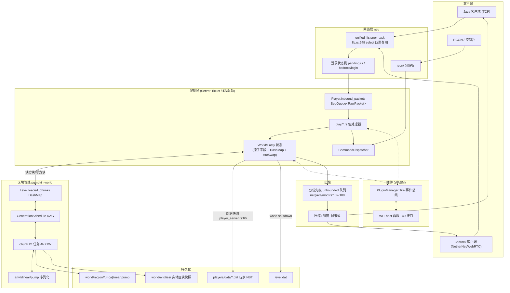
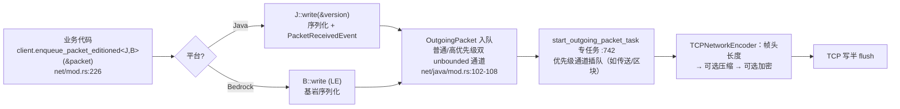
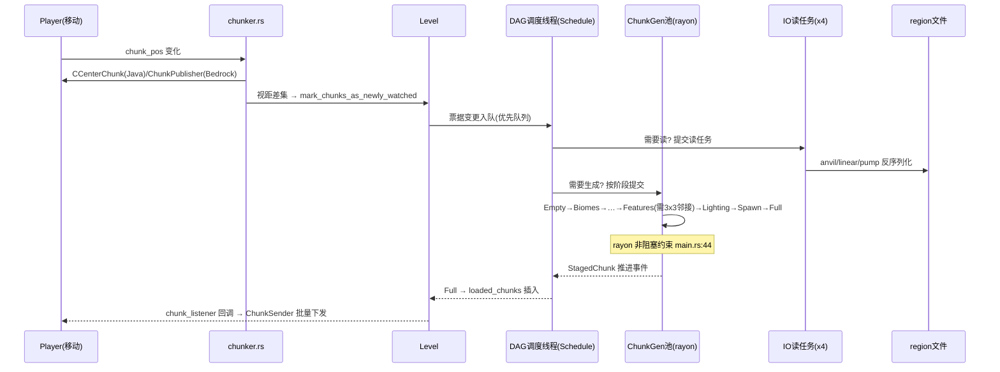
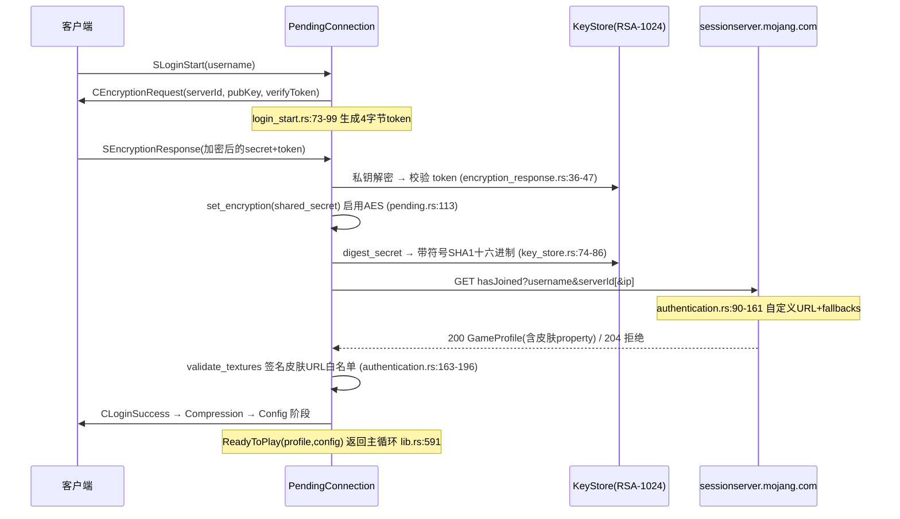
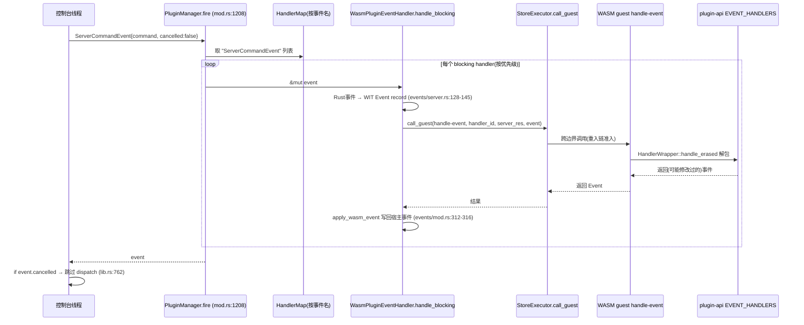

# 05 · 数据流

> 追踪数据在各子系统间的形态变化：网络包、区块、实体/玩家存档、命令、插件事件、配置。所有引用均给出 文件:行号。

## 5.1 总体数据流图



## 5.2 入站包：从字节到游戏状态（Java Play 阶段示例 `/give`）

| 步骤 | 数据形态 | 位置 | 变换说明 |
|------|---------|------|---------|
| 1 | TCP 字节流 | `net/java/pending.rs:82` into_split | 读/写半拆分，BufReader/Writer 包装 |
| 2 | 解帧后 `RawPacket{id, payload: Bytes}` | `TCPNetworkDecoder`（`pending.rs:65,138-168`） | 长度前缀 VarInt → 若有压缩先解压 → 若有加密 AES-CFB8 解密 → 剩余为 id+负载 |
| 3 | 推入 `Player.inbound_packets: SegQueue<RawPacket>` | `net/java/mod.rs:368` | 网络任务与游戏 tick 解耦的关键队列 |
| 4 | tick 内弹出（≤64/tick） | `entity/player.rs:2490-2560` | `process_inbound_packets` 在 Player::tick 开头执行 |
| 5 | `PacketReceivedEvent{id,payload}` | `net/java/mod.rs:885-893` | 插件可取消/替换 |
| 6 | 强类型包结构 `SChatCommand{command}` | `handle_play_packet` match + `Sxxx::read(&mut payload, &version)` | codec 按**当前协议版本**反序列化（多版本 ID） |
| 7 | `PlayerCommandSendEvent`（可取消） | `net/java/play/chat_command.rs:16-23` | 业务前置钩子 |
| 8 | 命令解析产物 `CommandContext{arguments: FxHashMap<String, Arc<ParsedArgument>>}` | `pumpkin-command/src/node/dispatcher.rs:422-519` | 输入字符串 → 解析树 → 参数表 |
| 9 | 游戏状态变更：`Inventory` 槽位、`Entity.pos` 原子写、`World` 方块更新缓冲 | `command/commands/give.rs:22-88` | 副作用集中在处理器内 |

## 5.3 出站包：从游戏状态到字节



**区块数据特殊路径**：`send_chunks`（`net/mod.rs:289`）→ `chunk_sender.rs` 批处理（`prepare_batch/commit_batch`，`player.rs:2661-2726`），Java 走 chunk batching（客户端 CChunkBatch 节流反馈），避免大区块包阻塞普通队列。

## 5.4 区块数据流（加载与保存双 Pipeline）

### 加载（玩家视距触发）



### 保存（自动保存 + 关停）

| 触发 | 路径 | 说明 |
|------|------|------|
| 每 `autosave_ticks` | `World::tick_environment`（`world/mod.rs:1891-1897`）置 `should_save` + `level_channel.notify()` | 保存动作在 chunk 系统线程异步完成，不占 tick |
| 区块卸载 | `mark_chunk_as_not_watched` → ChunkSaver 收集脏块 | 按格式序列化写回 region |
| 玩家数据 | `ServerPlayerData::tick`（`data/player_server.rs:66-99`）按 cron 间隔 rayon::spawn 落盘 | 全体玩家 NBT 快照 |
| 关停 | `Server::shutdown`（`server/mod.rs:747-767`）：TaskTracker 收尾 → 各世界 shutdown（3s join 超时 `level.rs:377-387`）→ 写 level.dat | 顺序保证见 06-控制流 |

**实体持久化**：实体 tick 修改 `Entity` 原子字段 → 保存时 `write_nbt`（`entity/mod.rs:144`）→ 实体区块 `SyncEntityChunk` **整块快照写**（commit `04d0276` 修复追加式导致的数据重复）。

## 5.5 登录认证数据流（Java online-mode）



Bedrock 侧等价物：`pumpkin-auth` OIDC 链（JWKS → ES384 验签 → xuid/xname 提取，`jwt/mod.rs:311-533`）。

## 5.6 命令数据流（多入口汇聚）

```mermaid
flowchart LR
    subgraph SOURCES["输入源"]
        CHAT["聊天 SChatCommand"]
        CONSOLE["rustyline/stdin 控制台<br/>lib.rs:753,817"]
        RCONS["RCON rcon/mod.rs:176"]
        CB["命令方块 block/blocks/command.rs:137"]
        FUNC["数据包函数 datapack/mod.rs:445"]
    end
    EV["ServerCommandEvent / PlayerCommandSendEvent<br/>可取消（插件 veto 点）"]
    DISP["CommandDispatcher::handle_command"]
    TREE["解析树 → CommandContext"]
    EXE["Executor.execute(source, ctx)"]
    FB["send_feedback → 出站包"]
    SOURCES --> EV --> DISP --> TREE --> EXE --> FB
```



数据变换：`String` →（词法+树匹配）→ `ParsedNode 链 + FxHashMap<String, Arc<ParsedArgument>>` →（执行器下取）→ 强类型参数（`EntitySelector`/`ItemArg`/`BlockPos`…）。

## 5.7 插件事件数据流（以取消一次命令为例）



**资源句柄管理**：跨边界引用（Player/World/Context…）以 WIT resource 形式登记在 `PluginHostState.resource_table`（`state.rs:104-183`），事件结束 `cleanup_event` 统一释放——防止 WASM 侧泄漏宿主引用。

## 5.8 配置与静态数据流（离线管线）

```
Minecraft 官方数据提取 → assets/*.json (仓库内)
    ↓ tools/pumpkin-codegen (离线运行, rayon 并行)
pumpkin-data/src/generated/*.rs (73MB, include 进 crate)
    ↓ 编译期 feature 选择 (item_id_remap 等 17 个)
pumpkin-protocol 序列化时的 ID 翻译表
    ↓ 运行期
Java/Bedrock 客户端各自版本的数字 ID
```

运行期配置：`pumpkin.toml` → `PumpkinConfig`（加载时合并默认值并回写缺失项，`pumpkin-config/src/lib.rs:283-429`）→ 以 `Arc`/`ArcSwap` 分发到 Server 字段 → 各子系统读取（视距/压缩/限速/沙箱…）。

## 5.9 关键数据结构与不变式

| 结构 | 位置 | 不变式/说明 |
|------|------|------------|
| `RawPacket{id, payload}` | `pumpkin-protocol` | 未解码的原始包；id 随协议版本可变（`to_id(version)`） |
| `SyncChunk` | `pumpkin-world/src/chunk/` | Arc 共享的区块数据；修改需经方块更新缓冲以批量广播 |
| `Player.inbound_packets: SegQueue` | `player.rs:531` | 单调追加；tick 消费上限 64 防饿死其他玩家 |
| `entities: ArcSwap<Vec<Arc<dyn EntityBase>>>` | `world/mod.rs:260` | tick 中过滤活跃区块后按批 par_chunks(16) 只读遍历 |
| `HandlerMap: HashMap<&'static str, Vec<handler>>` | `plugin/mod.rs:212` | ArcSwap 无锁读；注册/注销走 rcu |
| `tick_times_nanos: [i64;100]` | `server/mod.rs:134` | 环形数组 + `aggregated` 原子和 → MSPT/TPS（`server/mod.rs:1199-1222`） |
