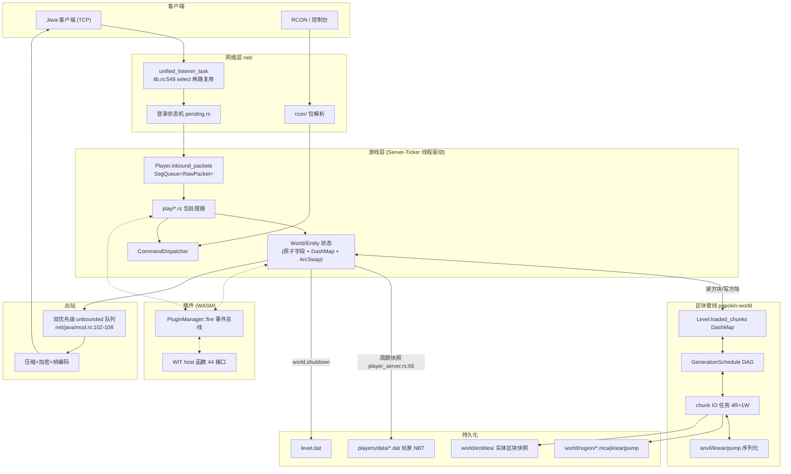
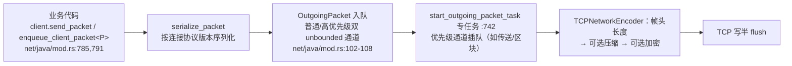
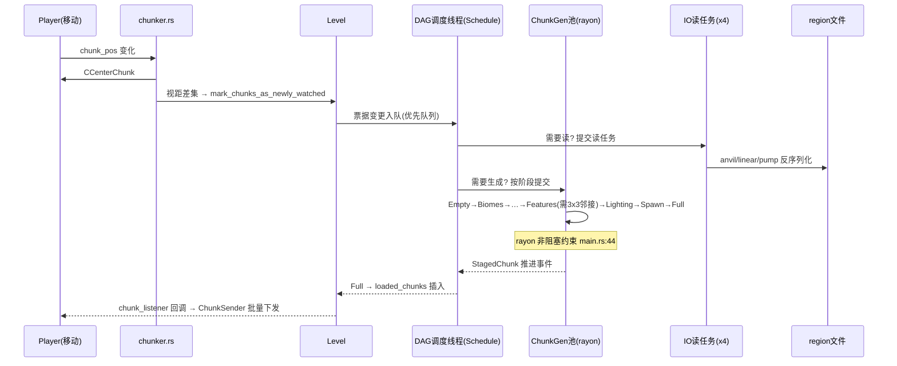
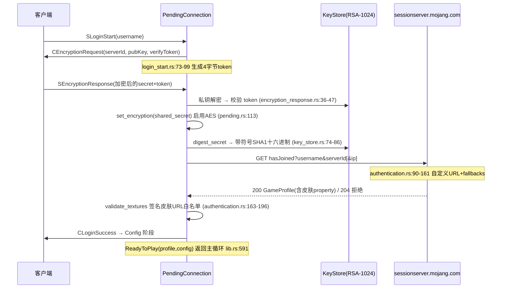
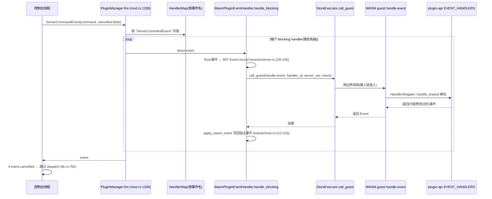

# 05 · 数据流

> 追踪数据在各子系统间的形态变化：网络包、区块、实体/玩家存档、命令、插件事件、配置。所有引用均给出 文件:行号。

## 5.1 总体数据流图


```mermaid
flowchart TB
    subgraph CLIENTS["客户端"]
        JC["Java 客户端 (TCP)"]
        RCONC["RCON / 控制台"]
    end
    subgraph NET["网络层 net/"]
        ACC["unified_listener_task<br/>lib.rs:549 select 两路复用"]
        LOGIN["登录状态机 pending.rs"]
        JC --> ACC --> LOGIN
        RCONC --> RCON["rcon/ 包解析"]
    end
    subgraph GAME["游戏层 (Server-Ticker 线程驱动)"]
        PKTQ["Player.inbound_packets<br/>SegQueue&lt;RawPacket&gt;"]
        HANDLERS["play/*.rs 包处理器"]
        WORLDST["World/Entity 状态<br/>(原子字段 + DashMap + ArcSwap)"]
        CMDD["CommandDispatcher"]
        LOGIN --> PKTQ --> HANDLERS --> WORLDST
        HANDLERS --> CMDD
        RCON --> CMDD
    end
    subgraph CHUNK["区块管线 papokin-world"]
        LVL["Level.loaded_chunks DashMap"]
        DAG["GenerationSchedule DAG"]
        IO["chunk IO 任务 4R+1W"]
        FMT["anvil/linear/pump 序列化"]
        LVL <--> DAG <--> IO <--> FMT
        WORLDST <-->|"读方块/写方块"| LVL
    end
    subgraph PERSIST["持久化"]
        REG["world/region/*.mca|linear|pump"]
        ENT["world/entities/ 实体区块快照"]
        PDAT["players/data/*.dat 玩家 NBT"]
        LVLDAT["level.dat"]
        IO --> REG & ENT
        WORLDST -->|"周期快照 player_server.rs:66"| PDAT
        WORLDST -->|"world.shutdown"| LVLDAT
    end
    subgraph PLUG["插件 (WASM)"]
        EVT["PluginManager::fire 事件总线"]
        WHOST["WIT host 函数 44 接口"]
        HANDLERS <-.-> EVT <-.-> WHOST
    end
    WORLDST <-.-> EVT
    subgraph OUT["出站"]
        OUTQ["双优先级 unbounded 队列<br/>net/java/mod.rs:102-108"]
        ENC["压缩+加密+帧编码"]
        WORLDST --> OUTQ --> ENC --> JC
    end
```

## 5.2 入站包：从字节到游戏状态（Java Play 阶段示例 `/give`）

| 步骤 | 数据形态 | 位置 | 变换说明 |
|------|---------|------|---------|
| 1 | TCP 字节流 | `net/java/pending.rs:82` into_split | 读/写半拆分，BufReader/Writer 包装 |
| 2 | 解帧后 `RawPacket{id, payload: Bytes}` | `TCPNetworkDecoder`（`papokin-protocol/src/java/packet_decoder.rs`，注释自明顺序：解密 → 解压 → 原始） | AES-CFB8 流解密（若启用）→ 长度前缀 VarInt 解帧 → 超压缩阈值则 zlib 解压 → 剩余为 id+负载 |
| 3 | 推入 `Player.inbound_packets: SegQueue<RawPacket>` | `net/java/mod.rs:368` | 网络任务与游戏 tick 解耦的关键队列；双高水位 **256 包 / 32 MiB**（`net/java/mod.rs:160-171`），超限即断开防 OOM |
| 4 | tick 内弹出（≤64/tick） | `entity/player.rs:2490-2560` | `process_inbound_packets` 在 Player::tick 开头执行 |
| 5 | `PacketReceivedEvent{id,payload}` | `net/java/mod.rs:885-893` | 插件可取消/替换 |
| 6 | 强类型包结构 `SChatCommand{command}` | `handle_play_packet` match + `Sxxx::read(&mut payload, &version)` | codec 按**当前协议版本**反序列化（多版本 ID） |
| 7 | `PlayerCommandSendEvent`（可取消） | `net/java/play/chat_command.rs:16-23` | 业务前置钩子 |
| 8 | 命令解析产物 `CommandContext{arguments: FxHashMap<String, Arc<ParsedArgument>>}` | `papokin-command/src/node/dispatcher.rs:422-519` | 输入字符串 → 解析树 → 参数表 |
| 9 | 游戏状态变更：`Inventory` 槽位、`Entity.pos` 原子写、`World` 方块更新缓冲 | `command/commands/give.rs:22-88` | 副作用集中在处理器内 |

## 5.3 出站包：从游戏状态到字节


```mermaid
flowchart LR
    A["业务代码<br/>client.send_packet / enqueue_client_packet&lt;P&gt;<br/>net/java/mod.rs:785,791"] --> C1["serialize_packet<br/>按连接协议版本序列化"]
    C1 --> D["OutgoingPacket 入队<br/>普通/高优先级双 unbounded 通道<br/>net/java/mod.rs:102-108"]
    D --> E["start_outgoing_packet_task 专任务 :742<br/>优先级通道插队（如传送/区块）"]
    E --> F["TCPNetworkEncoder：帧头长度<br/>→ 可选压缩 → 可选加密"]
    F --> G["TCP 写半 flush"]
```

**区块数据特殊路径**：`send_chunks`（`net/java/mod.rs:470`）→ `chunk_sender.rs` 批处理（`prepare_batch/commit_batch`，`player.rs:2661-2726`），走 chunk batching（客户端 CChunkBatch 节流反馈），避免大区块包阻塞普通队列。

> **2026-10-04 进度（性能轮次 2）**：上述编解码器的三块复用缓冲（压缩/组帧/负载 scratch）已加 256 KiB 留存上限与防振荡收缩/换新（`packet_encoder.rs:24` 起、`packet_decoder.rs:202`）；旧行为为按历史最大包终身驻留（64 连接 ≈ 196 MiB 死账）。量化对比见 [report/perf/round-02](report/perf/round-02-连接-scratch-容量治理.md)。
>
> **2026-10-04 进度（性能轮次 3）**：`encode_batch` 与 `send_chunks` 的序列化缓冲在移交 `Bytes` 前 `shrink_to_fit()`——此前编码缓存条目（每玩家上限 8192 条）一律按 32 KiB 预分配容量驻留（`Bytes::from(Vec)` 原样接管含容量的分配），实测缓存留存 -52.3% 且恰等于内容总量。见 [report/perf/round-03](report/perf/round-03-区块编码缓存容量裁剪.md)。
>
> **2026-10-04 进度（性能轮次 4）**：编码缓存逐出策略由「>8192 条整体清空」改为「32 MiB 字节预算 + 距玩家最远优先逐出至 80%」（`player.rs:2579`、`chunk_sender.rs:395`）——旅途模拟缓存峰值 170.6→32.0 MiB（-81.2%），清空风暴误伤热数据导致的重编码同步消除（总编码次数 -6.7%），发送流哈希两模式全等。见 [report/perf/round-04](report/perf/round-04-区块编码缓存逐出策略.md)。
>
> **2026-10-04 进度（性能轮次 8）**：编码器的 zlib 压缩上下文不再随每连接常驻（实测 313 KiB/份），改为线程局部池按级别检出、用毕归还（`packet_encoder.rs` 的 `COMPRESSOR_POOL`/`PooledCompressor`）——逐包 `reset()`+`Finish` 的无状态语义使上下文可跨连接互换，128 连接负载上下文存活 39.2 MiB→337 KiB（-99.2%），线上字节逐包全等。解码侧流式解压跨包有状态，不可池化、不在本轮。见 [report/perf/round-08](report/perf/round-08-zlib压缩上下文池化.md)。〔**2026-10-04 勘误**：-99.2% 为单线程模型；生产压缩走 `frame_batch_maybe_offload` 的 `spawn_blocking`，线程局部池在满负载时收益归零，轮次 9 已改全局有界池〕
>
> **2026-10-04 进度（性能轮次 9）**：压缩资源（zlib 上下文 + 压缩暂存捆绑）改全局有界池 `COMPRESSION_RESOURCE_POOL`（16 份封顶、池空检出永远新建不阻塞），编码器 `compression_scratch` 字段同步移除；驻留与线程/连接数无关（W=128 极端拓扑 65.1→8.0 MiB，-87.7%）。顺带修复轮次 2 暂存预留不足潜在缺陷（`reserve(hint-既有容量)` 在既有容量 < hint/2 时预留不足，渐进增大的不可压缩包可致组帧失败断连；已改全量预留并加回归测试）。见 [report/perf/round-09](report/perf/round-09-压缩资源全局有界池.md)。
>
> **2026-10-04 进度（性能轮次 10）**：组帧缓冲统一全局有界池 `FRAME_BUFFER_POOL`（16 份封顶、池空检出永远新建）：`write_packet` 单包路径的每连接常驻 `frame_scratch`（≤256 KiB，生产仅登录/配置阶段使用，登录后随连接空转）与批路径 `frame_packet_batch` 的逐批 `Vec::new()` 流失收编为同一池检出/归还（归还时逾 2×256 KiB 收缩回上限）。协议编码路径 per-connection 驻留至此清零：128 连接组帧驻留 32.0→2.75 MiB（W=16，-91.4%）/ 4.0 MiB（W=128，-87.5%），池复用率 99.4%，线上字节逐包全等。见 [report/perf/round-10](report/perf/round-10-组帧缓冲全局池化.md)。
>
> **2026-10-04 进度（性能轮次 7）**：编码缓存由每玩家私有（各 32 MiB）改为**按世界共享**（`World::chunk_encode_cache`，DashMap 以（协议版本, 坐标）为键，64 MiB 全局预算，距所有玩家最远优先逐出 + 卸载死条目清扫）——同版本玩家注视同一区块只编码一次、驻留一份，发送侧内存与玩家数脱钩。失效语义同步闭合：`ChunkData` 新增内容改动代数（任何置脏变异经 `mark_modified()` 单调递增），`EncodedChunk` 记录编码前捕获的代数，`is_fresh_for` 增代数校验——**修复存量陈旧重发缺陷**：此前原地方块变异不失效缓存（新鲜度仅弱引用+Arc 同一），久离重回的玩家会收到修改前的整包旧编码（基准量化：稀疏变异 2 次/tick 时 34 671 次陈旧发送）。4 人旅途实测缓存峰值 105.2→64.0 MiB（-39.2%）、单 tick 编码峰值 2340→585、同正确性口径编码数 -40.1%。见 [report/perf/round-07](report/perf/round-07-共享区块编码缓存.md)。

## 5.4 区块数据流（加载与保存双 Pipeline）

### 加载（玩家视距触发）


```mermaid
sequenceDiagram
    participant P as Player(移动)
    participant CH as chunker.rs
    participant L as Level
    participant D as DAG调度线程(Schedule)
    participant G as ChunkGen池(rayon)
    participant IO as IO读任务(x4)
    participant F as region文件
    P->>CH: chunk_pos 变化
    CH->>P: CCenterChunk
    CH->>L: 视距差集 → mark_chunks_as_newly_watched
    L->>D: 票据变更入队(优先队列)
    D->>IO: 需要读? 提交读任务
    IO->>F: anvil/linear/pump 反序列化
    D->>G: 需要生成? 按阶段提交
    G->>G: Empty→Biomes→…→Features(需3x3邻接)→Lighting→Spawn→Full
    Note over G: rayon 非阻塞约束 main.rs:44
    G-->>D: StagedChunk 推进事件
    D-->>L: Full → loaded_chunks 插入
    L-->>P: chunk_listener 回调 → ChunkSender 批量下发
```

### 保存（自动保存 + 关停）

| 触发 | 路径 | 说明 |
|------|------|------|
| 每 `autosave_ticks` | `World::tick_environment`（`world/mod.rs:1622`，置位于 :1658）置 `should_save` + `level_channel.notify()` | 保存动作在 chunk 系统线程异步完成，不占 tick |
| 区块卸载 | `mark_chunk_as_not_watched` → ChunkSaver 收集脏块 | 按格式序列化写回 region |
| 玩家数据 | `ServerPlayerData::tick`（`data/player_server.rs:66-99`）按 cron 间隔 rayon::spawn 落盘 | 全体玩家 NBT 快照 |
| 关停 | `Server::shutdown`（`server/mod.rs:747-767`）：TaskTracker 收尾 → 各世界 shutdown（**60s** join 超时 `level.rs:385` `TASK_WAIT_TIMEOUT`）→ 写 level.dat | 顺序保证见 06-控制流 |

**实体持久化**：实体 tick 修改 `Entity` 原子字段 → 保存时 `write_nbt`（`entity/mod.rs:144`）→ 实体区块 `SyncEntityChunk` **整块快照写**（commit `04d0276` 修复追加式导致的数据重复）。

> **2026-10-04 进度（性能轮次 5）**：区段方块存储新增第三层——`PalettedContainer` 在 Homogeneous / Indexed(u8) / Dense 之间插入 Nibble 层：调色板 ≤16 态时索引改 4 bit 半字节存储（4096 B → 2048 B/区段，`palette.rs:36`），升级链 Nibble→Indexed(>16 态)→Dense(>256 态) 与既有单层升级语义一致（只升不降）；磁盘/网络序列化字节与旧实现逐字节一致（2400 区段混合负载实测容器存活 -39.1%，变异耗时 171→162 ms）。见 [report/perf/round-05](report/perf/round-05-调色板半字节索引存储.md)。

> **2026-10-04 进度（性能轮次 6）**：区段光照容器均质归一——落载（`format/mod.rs`）与生成/重照收尾（`chunk_state.rs`）对均质 2048 B 数组降级为 `Empty(v)`（1 B）：**天空光仅均质 15 可降级**（缺失天空数组在原版/客户端语义中视为 15，均质 0 降级会漏光），方块光任意均质值可降级；保存侧对 `Empty(v≠0)` 物化回均质数组（0xFF 进 0xFF 出，与原版逐字节一致）、`Empty(0)` 省略（解码同为全 0）。顺带修复重照路径 `Empty(15)` 天空光保存省略后读回全黑的存量 bug。1200 区块负载实测光照容器存活 -51.0%，落盘/网络各 -7.5%。见 [report/perf/round-06](report/perf/round-06-光照容器均质归一.md)。

## 5.5 登录认证数据流（Java online-mode）


```mermaid
sequenceDiagram
    participant C as 客户端
    participant S as PendingConnection
    participant K as KeyStore(RSA-1024)
    participant M as sessionserver.mojang.com
    C->>S: SLoginStart(username)
    S->>C: CEncryptionRequest(serverId, pubKey, verifyToken)
    Note over S: login_start.rs:73-99 生成4字节token
    C->>S: SEncryptionResponse(加密后的secret+token)
    S->>K: 私钥解密 → 校验 token (encryption_response.rs:36-47)
    S->>S: set_encryption(shared_secret) 启用AES (pending.rs:113)
    S->>K: digest_secret → 带符号SHA1十六进制 (key_store.rs:74-86)
    S->>M: GET hasJoined?username&serverId[&ip]
    Note over M: authentication.rs:90-161 自定义URL+fallbacks
    M-->>S: 200 GameProfile(含皮肤property) / 204 拒绝
    S->>S: validate_textures 签名皮肤URL白名单 (authentication.rs:163-196)
    S->>C: CLoginSuccess → Config 阶段
    Note over S: ReadyToPlay(profile,config) 返回主循环 lib.rs:591
```

**压缩启用时点**：若配置开启，SetCompression 在 **SLoginStart 校验通过后立即下发**（`login_start.rs:131-133`），先于加密请求与 CLoginSuccess——不是"登录成功后才压缩"。

**登录阶段一次性门控与复核**（15 §一/§二审计后落地）：`PendingConnection` 以原子字段防御重放与状态机乱序——`login_success_sent: AtomicBool`（`pending.rs:90`，发送门 :470）保证 CLoginSuccess 只发一次；握手阶段 fire `PlayerHandshakeEvent`（`pending.rs:315`，可否决）；玩家实际入列后再做**满员二次复核**（`lib.rs:533-552`）——登录期检查距入列隔着客户端掌控节奏的 Config 阶段，并发登录可全部通过后同时入世超额，此处以真实计数踢出最新加入者。

**入网突发（join burst）**：`World::spawn_java_player`（`world/mod.rs:2495` 起，600+ 行）在玩家入世时按序发出——`CLogin`（维度/世界名/游戏规则）→ `CUpdateTagsPlay::with_merged`（全量标签同步）→ `CServerData`（MOTD）→ `CSetChunkCacheRadius`/`CSetSimulationDistance` → `CPlayerInfoUpdate`（全员列表）→ 视距内实体 `CSpawnEntity`/`CSetEntityMetadata`/`CSetEquipment` → `CGameEvent::StartWaitingChunks`（触发区块批量下发）→ `CPlayerSpawnPosition` → 天气/血量/经验 → `CUpdateRecipes` + `CRecipeBookAdd`（配方全量解锁，见 16）。客户端设置包 `SClientInformationConfig` 入 `PlayerConfig` 8 项（locale/视距/聊天模式/主手等，`net/java/config/client_information.rs:19-30`）；`particle_status` 字段协议侧已解析（≥1.21.2）但未入 PlayerConfig。

## 5.6 命令数据流（多入口汇聚）


```mermaid
flowchart LR
    subgraph SOURCES["输入源"]
        CHAT["聊天 SChatCommand"]
        CONSOLE["rustyline/stdin 控制台<br/>lib.rs:753,817"]
        RCONS["RCON rcon/mod.rs:176"]
        CB["命令方块 block/blocks/command.rs:137"]
        FUNC["数据包函数 datapack/mod.rs:445"]
    end
    EV["ServerCommandEvent / PlayerCommandSendEvent<br/>可取消（插件 veto 点）"]
    DISP["CommandDispatcher::handle_command"]
    TREE["解析树 → CommandContext"]
    EXE["Executor.execute(source, ctx)"]
    FB["send_feedback → 出站包"]
    SOURCES --> EV --> DISP --> TREE --> EXE --> FB
```

数据变换：`String` →（词法+树匹配）→ `ParsedNode 链 + FxHashMap<String, Arc<ParsedArgument>>` →（执行器下取）→ 强类型参数（`EntitySelector`/`ItemArg`/`BlockPos`…）。

## 5.7 插件事件数据流（以取消一次命令为例）


```mermaid
sequenceDiagram
    participant Console as 控制台线程
    participant PM as PluginManager.fire (mod.rs:1208)
    participant H as HandlerMap(按事件名)
    participant W as WasmPluginEventHandler.handle_blocking
    participant RT as StoreExecutor.call_guest
    participant G as WASM guest handle-event
    participant API as plugin-api EVENT_HANDLERS
    Console->>PM: ServerCommandEvent{command, cancelled:false}
    PM->>H: 取 "ServerCommandEvent" 列表
    loop 每个 blocking handler(按优先级)
        PM->>W: &mut event
        W->>W: Rust事件 → WIT Event record (events/server.rs:128-145)
        W->>RT: call_guest(handle-event, handler_id, server_res, event)
        RT->>G: 跨边界调用(重入链准入)
        G->>API: HandlerWrapper::handle_erased 解包
        API-->>G: 返回(可能修改过的)事件
        G-->>RT: 返回 Event
        RT-->>W: 结果
        W->>W: apply_wasm_event 写回宿主事件 (events/mod.rs:312-316)
    end
    PM-->>Console: event
    Console->>Console: if event.cancelled → 跳过 dispatch (lib.rs:762)
```

**资源句柄管理**：跨边界引用（Player/World/Context…）以 WIT resource 形式登记在 `PluginHostState.resource_table`（`state.rs:104-183`），事件结束 `cleanup_event` 统一释放——防止 WASM 侧泄漏宿主引用。

## 5.8 配置与静态数据流（离线管线）

```
Minecraft 官方数据提取 → assets/*.json (仓库内)
    ↓ tools/papokin-codegen (离线运行, rayon 并行)
papokin-data/src/generated/*.rs (约 67MB, include 进 crate)
    ↓ 编译期 feature 选择 (item_id_remap 等 15 个)
存档读取路径的 ID 重映射表
    ↓ 运行期
旧版存档加载时重写为 1.21.11 的数字 ID
```

运行期配置：`papokin.toml` → `PapokinConfig`（加载时合并默认值并回写缺失项，`papokin-config/src/lib.rs:283-429`）→ 以 `Arc`/`ArcSwap` 分发到 Server 字段 → 各子系统读取（视距/压缩/限速/沙箱…）。

## 5.9 关键数据结构与不变式

| 结构 | 位置 | 不变式/说明 |
|------|------|------------|
| `RawPacket{id, payload}` | `papokin-protocol` | 未解码的原始包；id 随协议版本可变（`to_id(version)`） |
| `SyncChunk` | `papokin-world/src/chunk/` | Arc 共享的区块数据；修改需经方块更新缓冲以批量广播 |
| `Player.inbound_packets: SegQueue` | `player.rs:531` | 单调追加；tick 消费上限 64 防饿死其他玩家 |
| `entities: ArcSwap<Vec<Arc<dyn EntityBase>>>` | `world/mod.rs:260` | tick 中过滤活跃区块后按批 chunks(16) 只读遍历（小集合串行，见 04 §4.2） |
| `HandlerMap: HashMap<&'static str, Vec<handler>>` | `plugin/mod.rs:212` | ArcSwap 无锁读；注册/注销走 rcu |
| `tick_times_nanos: [i64;100]` | `server/mod.rs:134` | 环形数组 + `aggregated` 原子和 → MSPT/TPS（`server/mod.rs:1209-1226`） |
