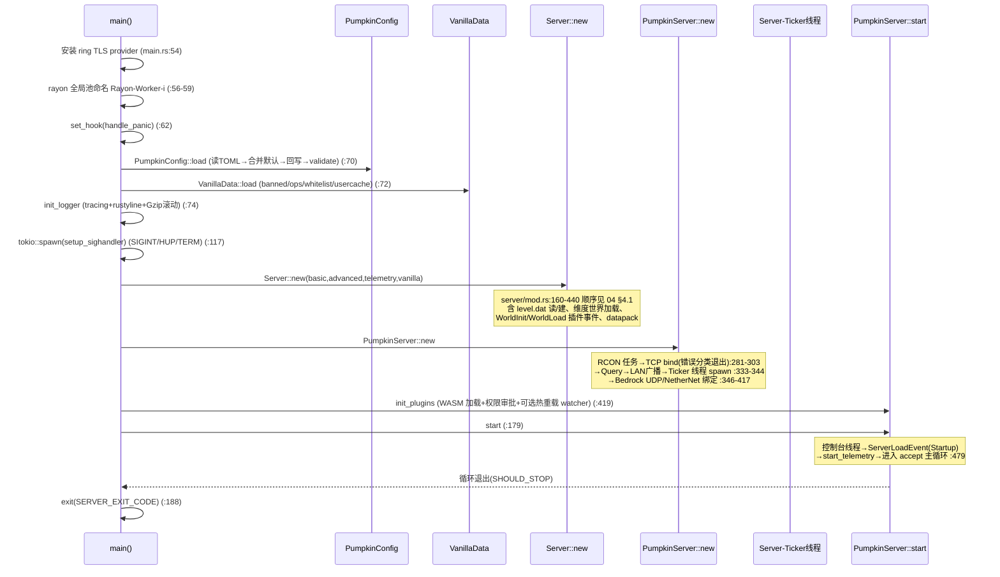
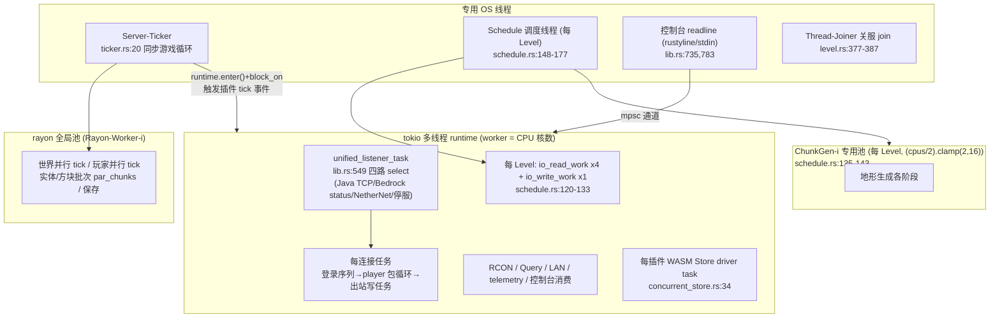
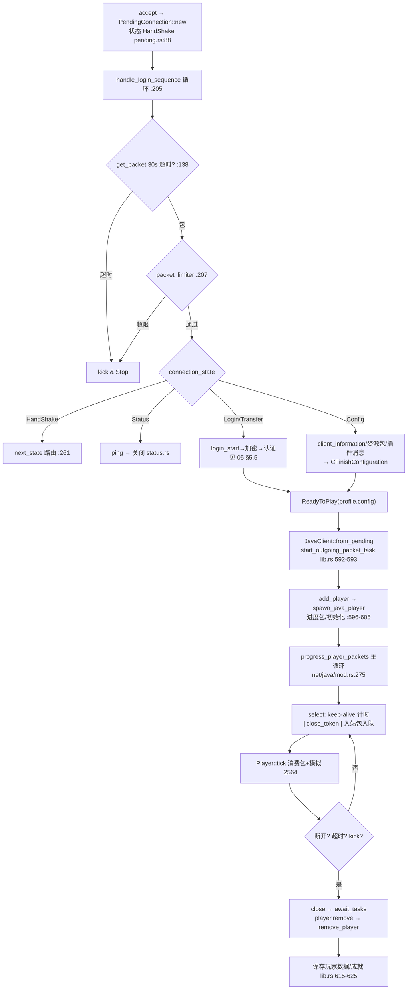
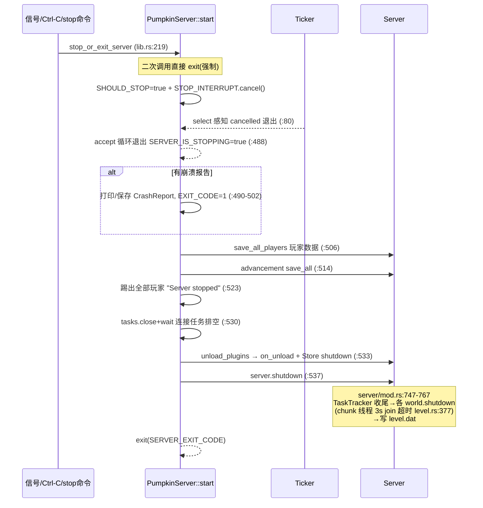
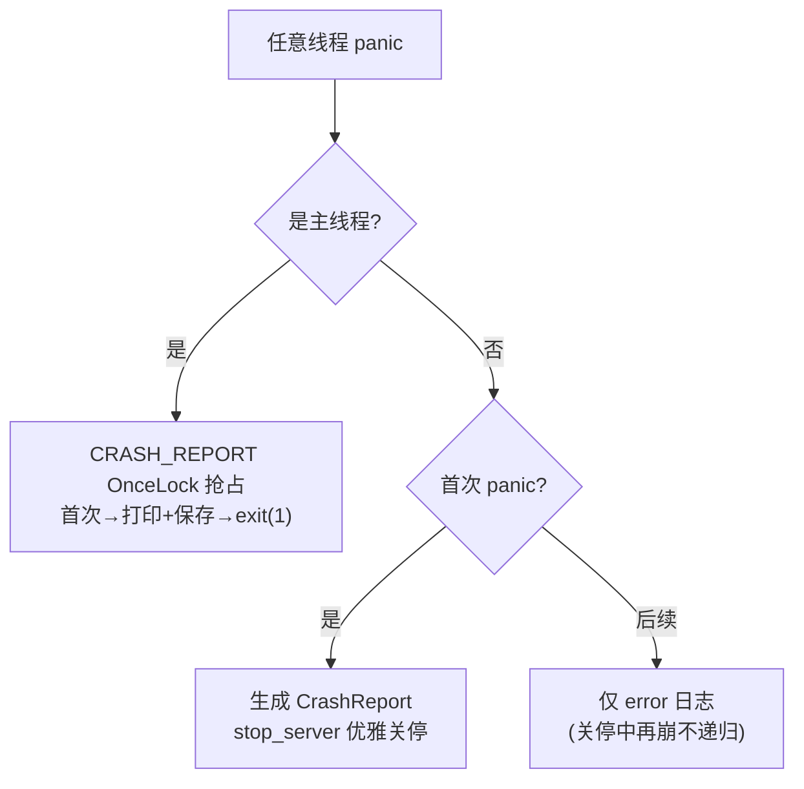

# 06 · 控制流

> 覆盖：进程启动序列、线程模型、主循环控制、连接接入控制、关停序列、异常/崩溃路径。

## 6.1 进程启动序列（`main.rs:48-189` + `lib.rs:249-358`）

**启动失败的快速退出点**：TCP 端口占用/权限/不可用（`lib.rs:283-302`，各 `exit(1)`）；Bedrock UDP 绑定失败（`lib.rs:414`）；Ticker 线程 spawn 失败（`lib.rs:340-343`）；level.dat 版本不支持（`server/mod.rs:181-227`）。

## 6.2 线程/执行域模型（全图）

**跨池铁律**（`main.rs:44-46` 注释）：从 tokio 调用的 rayon 任务必须非阻塞；耗时结果经通道回传 tokio。

**并发写共享状态的手段**：`ArcSwap`（worlds/命令树/level_info——读多写少整体替换）、`DashMap`（区块表/权限注册表）、`AtomicCell`（Entity 全字段——并行 tick 无锁读写）、`SegQueue`（入站包）、`std Mutex`（小临界区，中毒后 `into_inner` 恢复）。

## 6.3 主循环控制（accept 循环 + tick 循环）

### accept 循环（tokio，`lib.rs:479-486` + `unified_listener_task:549-698`）

`select!` 四分支，循环至 `SHOULD_STOP`：

| 分支 | 动作 |
|------|------|
| Java TCP accept | 设 NODELAY → 分配 client_id（可选 IP 脱敏 `scrub_address`）→ spawn 连接任务：`PendingConnection::handle_login_sequence` → 成功则 `add_player` + `spawn_java_player` → 进入 `progress_player_packets`（keep-alive select 循环）→ 断开清理（保存数据/成就/移除玩家）|
| Bedrock status | `StatusResponder::receive`（UDP ping 应答） |
| NetherNet accept | 建 `BedrockClient` → 登录 → 同 Java 流程 |
| `STOP_INTERRUPT.cancelled()` | 返回 false 退出循环 |

**背压与防御**：EMFILE（fd 耗尽）睡眠 500ms 重试（`lib.rs:633-640`）；其余 accept 错误睡眠 50ms；包限速令牌桶（`packet_limiter.rs`）在登录期与 Play 期双重生效。

### tick 循环（专用线程，`ticker.rs:20-111`）

时序控制：`next_tick += nanoseconds_per_tick`（TPS 可运行时改，`tick_rate_manager.rs:82`）；超前则 `tokio::select!{sleep, cancelled}` 精确补眠；落后则钳制（防死亡螺旋）；sprint 模式 interval=0 连跑；freeze 模式只跑 `tick_players_and_network`（`server/mod.rs:1112`——保持连接活性但不推进模拟）。

## 6.4 连接生命周期控制流（Java，完整）

## 6.5 关停序列（正常停服）

## 6.6 异常与崩溃控制流

### panic 处理（`main.rs:233-305`）

### 错误分级（`error.rs:9-19`）

`PumpkinError` trait：`is_kick()`（该错误是否应踢玩家）/ `severity()` / `client_kick_reason()`。包处理错误在 `process_inbound_packets`（`player.rs:2522-2540`）按此分级：可踢错误 → `try_kick(原因)`；否则记录 error 日志继续。

### 其他防御点

| 机制 | 位置 |
|------|------|
| 登录 30s 空闲超时（防慢速占用 fd） | `pending.rs:47-55` |
| keep-alive 双向超时踢出 | `net/java/mod.rs:289-311` |
| 包速率令牌桶（登录期+游戏期） | `packet_limiter.rs`，`pending.rs:207` |
| 区块生成非阻塞约束（防 tokio 饿死） | `main.rs:44-46` |
| WASM 重入深度上限 64（防插件递归死锁） | `plugin-runtime chain.rs:12,117-129` |
| WASM 内存上限/沙箱目录/socket 策略 | `wasm_host/mod.rs:396-423,49-110` |
| 关停中二次中断 → 立即 exit | `lib.rs:219-225` |
| unix fd 上限自动提升（上限 1M，回退 65k） | `lib.rs:853-905` |

## 6.7 控制流要点总结

1. **双循环结构**：tokio 上的 accept/IO 循环 + 专用线程上的同步 tick 循环；两者通过 `Player.inbound_packets` 队列与 `Server.runtime` 句柄（`runtime.enter()`）桥接。
2. **停服是全局协作**：单一 `CancellationToken`（`STOP_INTERRUPT`）同时唤醒 accept 循环、tick 睡眠、控制台、各后台任务；`SERVER_IS_STOPPING` 防重入，`CRASH_REPORT` 区分优雅/崩溃退出码。
3. **tick 内的一切皆可并行**：世界间、玩家间、实体批、方块计划 tick、刷怪、保存 —— rayon 分批；但**插件 blocking 事件在 tick 线程 `block_on` 同步等待**，保证事件时序确定性。
4. **冻结/冲刺是一等状态**：`ServerTickRateManager`（`tick_rate_manager.rs:30-55`）让 `/tick freeze|step|sprint|rate` 直接改变循环节奏而不破坏 50ms 基准。
