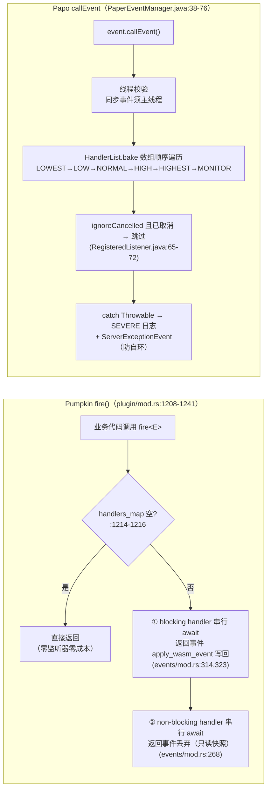

# 10 · 插件系统对比：Pumpkin（本项目） vs Papo（REF 参考）

> 生成时间：2026-09-20 · 方法：双侧源码核查（Pumpkin 侧主代理逐点验证；Papo 侧三路并行源码扫描：核心架构 / 事件·权限·命令·调度 / Papo 自有定制与配置面）
> **引用约定**：
> - Pumpkin 侧：`相对路径:行号`，以仓库根为根，行号为 master @ 3eee993d1 实际行号。WIT 契约位于 `crates/pumpkin-plugin-wit/v0.1/`（下称 **[WIT]**）。
> - Papo 侧：相对 `REF/Papo-Java-0.80.0-src/` 的路径行号。`paper-server/src/main/java/**` 为直提交生效源码；`patches/sources/**` 为 vanilla 补丁（行号为补丁内行号）；**[00XX]** 指 `paper-server/patches/features/00XX-*.patch`（Papo 特性补丁，行号为补丁内行号）。
>
> **时效说明**：本笔记为成文时点的对比快照（Pumpkin 侧行号锚定上述 commit，后续改动不回流）。§12「Pumpkin 可向 Papo 学」的 6 项在成文当日**已全部落地**，实现记录见 [11-插件API强化实现记录](11-插件API强化实现记录-Papo机制级覆盖.md)；插件 API 的当前权威参考见 [12-插件API文档](12-插件API文档.md)。

## 0. 一句话结论

**Papo：信任模型的 JVM 插件体系**——插件是拥有完整进程权限的 jar，靠"类共享 + 280 个事件挂点 + Brigadier 桥"与服务器深度互操作，二十年生态兼容是它的生命线；Papo 自己的创新几乎全部集中在**性能**（约 40 个"零监听器门控"补丁）与**信息防泄露**（指纹加固）。
**Pumpkin：能力沙箱模型（capability-based）的 WASM 组件插件**——插件默认零权限（无文件/网络/环境变量），逐项授权、逐项审计，靠 WIT 契约获得 273 种事件、命令、调度、IPC 乃至 **AI 目标与区块生成阶段**这类 Java 生态从未开放过的扩展点；代价是类共享式互操作不存在，生态兼容只能从零积累。

| | Pumpkin | Papo |
|---|---|---|
| 插件单元 | `.wasm` 组件（另有 native dylib 与自定义 loader 通道） | `.jar`（plugin.yml legacy 轨 + paper-plugin.yml Paper 轨） |
| 执行域 | wasmtime 组件实例，WASI 能力沙箱内 | 服务器 JVM 进程内，URLClassLoader 系 |
| 默认权限 | **无**（socket/env/文件系统/内存全部要授权） | **全部**（与服务器同权限） |
| API 稳定层 | WIT 契约 `pumpkin:plugin@0.1.0`（46 个 .wit，CI 强制双侧不漂移） | `org.bukkit.*`/`io.papermc.paper.*` Java API（SemVer + api-version 门控） |
| 事件数 | 273 种（[WIT] event.wit variant，:2160-2435） | 280 个 `*Event.java`（`org/bukkit/event/` 计数） |
| 互操作 | 插件间仅经 IPC 消息（沙箱隔离所迫） | 类共享：插件可直接调用彼此代码（生态基石） |

## 1. 总体架构

```mermaid
graph TB
    subgraph PUM["Pumpkin：能力沙箱模型"]
        W["插件 .wasm 组件<br/>init/on-load/on-unload<br/>16 个 guest 导出"] -->|"WIT 边界<br/>每次调用过 ABI"| RT["StoreExecutor<br/>重入链 深度≤64<br/>每插件 driver task"]
        RT --> HB["host-bindings<br/>(bindgen! 生成)"]
        HB --> PM["PluginManager (plugin/mod.rs:184)<br/>HandlerMap ArcSwap (mod.rs:173,187)"]
        PM --> SRV["Server 主逻辑<br/>fire / register-command / task_scheduler"]
        WASI["WASI 沙箱<br/>socket 策略 / env / 预开目录 / 内存上限<br/>(wasm_host/mod.rs:313-432)"] -.->|"能力按需授予"| W
        SIG["ed25519 签名校验<br/>(wasm_host/signature.rs)"] -.->|"加载前"| W
    end
    subgraph PAPO["Papo：信任模型 JVM"]
        J["插件 .jar<br/>JavaPlugin / PluginBootstrap"] -->|"类加载"| CL["PluginClassLoader<br/>每插件一个 + 全局/依赖组共享<br/>(PluginClassLoader.java:178-209)"]
        CL --> HL["HandlerList 静态注册表<br/>bake 数组无锁读 (HandlerList.java:189-196)"]
        HL --> PE["PaperEventManager.callEvent<br/>(PaperEventManager.java:38-76)"]
        PE --> CB["CraftBukkit / vanilla 挂点<br/>零监听器门控快路 [0050][0078]…"]
        REMAP["PluginRemapper<br/>mojang↔spigot 重映射<br/>(pluginremap/PluginRemapper.java)"] -.->|"加载前改写字节码"| J
    end
```

**范式差异一句话**：Pumpkin 把"插件能做什么"编码进**加载期能力授权**（运行期无需再设防，WASM 线性内存天然隔离）；Papo 把"插件不能做什么"编码进**运行期约定**（MONITOR 只准观察、命名空间不准伪装，全部靠自律 + 约定检查）。前者的安全边界强得多，后者的互操作能力强得多。

## 2. 插件形态、描述文件与判型

| 维度 | Pumpkin | Papo |
|---|---|---|
| 分发物 | `.wasm` 组件（主通道）；native `.dylib/.dll`（`plugin/loader/native.rs:16`，`libloading` 加载，以 `PUMPKIN_API_VERSION` 导出符号门控，:30-41）；**自定义 loader**（插件可注册 Lua/JS 等第三方加载器，`plugin/api/context.rs:349-368` `register_plugin_loader`） | `.jar`；`PluginFileType.guessType` 依次探测 `paper-plugin.yml`/`plugin.yml` 判型（`provider/type/PluginFileType.java:59-68`） |
| 描述文件 | 无独立描述文件——metadata 是 guest 导出（[WIT] plugin.wit `export metadata`），签名插件的元数据可含市场信息（[WIT] context.wit `marketplace-metadata`：license-key/is-paid/dev-id 等） | legacy：`PluginDescriptionFile`（YAML 手工解析）；Paper：`PaperPluginMeta`（Configurate 声明式，`provider/configuration/PaperPluginMeta.java:41-68`） |
| 多入口阶段 | 两阶段：`on-load(context)` / `on-unload(context)`（[WIT] plugin.wit）；无世界前阶段 | 三阶段：`bootstrap`（仅 Paper 插件，vanilla 引导前执行）→ `onLoad` → `onEnable`（`PluginLoadOrder` STARTUP/POSTWORLD 两档，`CraftServer.java:585-609`） |
| 依赖声明 | metadata 内依赖列表（加载期拓扑排序，`plugin/mod.rs:411-460`） | `depend/softdepend/load-before/load-after/provides`（`LoadOrderTree.java:34-55`；环检测 `JohnsonSimpleCycles`，:57-84） |
| 库依赖 | WASM 组件自带（编译期进组件） | 运行时 Maven 下载：plugin.yml `libraries`（Aether，缓存 `libraries/`）或 paper `loader:` 类 + `MavenLibraryResolver`（`LibraryLoader.java:56-83`） |

**判型哲学差异**：Papo 必须同时伺候两代插件（legacy Bukkit 轨 + Paper 轨），判型是入口问题；Pumpkin 没有历史包袱，判型退化为"文件扩展名 → 选 loader"（wasm/native/自定义），且 loader 集合本身开放扩展——这是 Papo 体系做不到的（`PluginFileType` 枚举封闭）。

## 3. 加载管线与生命周期

### 3.1 加载管线对照

| 阶段 | Pumpkin | Papo |
|---|---|---|
| 触发 | 启动时 `init_plugins`（`main.rs`）；`plugins.enabled=false` 整体跳过 | `Main` 中 `PluginInitializerManager.load`（`patches/sources/net/minecraft/server/Main.java.patch:34`；[0034] 将前后步骤异步化） |
| 文件发现 | 扫 `plugins/` 目录（loader 按扩展名认领） | 目录/flag/数组四类 ProviderSource（`provider/source/`），`update/` 目录自动更新（`FileProviderSource.java:42-96`） |
| 字节码预处理 | 无（.wasm 直接编译，`*.cwasm` 缓存 `plugins/cache/`，`wasm_host/mod.rs:286`） | **PluginRemapper**：spigot/obf → mojang 映射改写，缓存 `<plugins>/.paper-remapped/`，hash 指纹跳过（`pluginremap/PluginRemapper.java:45,146-211,225-264`）；legacy 插件另过 Commodore API 降级改写（`PluginClassLoader.java:240`） |
| 排序 | `topological_sort` 按依赖名（`plugin/mod.rs:412`，DFS + current_path 环报错） | Modern 策略：依赖合并 → 缺失硬依赖剔除 → `LoadOrderTree`（load-before/after 双向边）→ 拓扑排序 + `JohnsonSimpleCycles` 环检测；可 `-Dpaper.useLegacyPluginLoading` 回退 Spigot 迭代消解（`storage/ConfiguredProviderStorage.java:9-14`） |
| 权限审批 | **加载期交互式审批**：插件申请的 WASI 能力权限逐条过 `allowed_permissions`/`blocked_permissions` 清单，未命中则控制台询问（`ask_permission_confirmation`，`pumpkin-config/src/plugins.rs`；审批流 `plugin/mod.rs:835+`） | 无此概念（权限一词仅指玩家权限系统） |
| 全程同步性 | 加载为 async 但启动期一次完成 | 同步（主线程）；唯一异步是重映射线程池（`PluginRemapper.java:409-441`） |

### 3.2 生命周期回调与异常处置

| 事件 | Pumpkin | Papo |
|---|---|---|
| 世界前钩子 | 无 | `bootstrap(BootstrapContext)`（lifecycle 事件注册锁定在此，`BootstrapProviderStorage.java:33-45`）；**异常 → 该插件 ERRORED 跳过**（:39-45） |
| 实例创建 | `init-plugin`（宏 `register_plugin!` 生成） | legacy：`PluginClassLoader` 构造器内反射 `new JavaPlugin`（`PluginClassLoader.java:80-118`）；缺依赖 `UnknownDependencyException` |
| 加载回调 | `on-load` → 注册事件/命令/权限；返回 `result<_, string>` | `onLoad`（全部实例创建后逐个调用）；**异常仅记日志、仍会 onEnable**（`ServerPluginProviderStorage.java:56-63` 注释明示） |
| 启用回调 | 无独立 onEnable（on-load 即完成注册） | `onEnable`（按 STARTUP/POSTWORLD 分批，`CraftServer.java:585-643`）；**异常 → 立即 disablePlugin 该插件**（`PaperPluginInstanceManager.java:206-214`） |
| 卸载 | `on-unload` + handler/命令注销 + Store shutdown；**`loader.can_unload()` 不满足则仅置 `is_active=false` 不真正卸载**（`plugin/mod.rs:1102-1121`） | `onDisable`：先发 `PluginDisableEvent`，再关 classloader、取消调度任务、注销 services/handlers/messenger/chunk tickets（`PaperPluginInstanceManager.java:240-330`） |
| 热重载 | **逐插件**：notify watcher 监听 `.wasm` 变更 → unload 旧 → load 新（`plugin/mod.rs:289-386`，`hot_reload` 配置默认 false） | **无逐插件卸载 API**（未找到）；`/reload` 全量重建（`CraftServer.reload:957` → 清空存储重发现 → `ServerLoadEvent.RELOAD`），且明确警告 Paper 插件不支持 reload（`PluginInitializerManager.java:171-176`） |
| api-version 门控 | 无版本协商（WIT world 版本号即契约，CI 强制一致） | legacy：`checkSupported`（`CraftMagicNumbers.java:364-385`：高于当前拒载、低于 `minimum-api` 拒载、<1.13 启用 CraftLegacy）；Paper：解析期强制 `apiVersion` 必填且 ≥1.19（`PaperPluginMeta.java:73,89-91`） |

**生命周期结论**：Papo 的生命周期钩子更多（三阶段 + 两档 load order + 完整异常分级），这是十年运维教训的沉淀；Pumpkin 两阶段但多出**热重载**这张 Papo 没有的牌。两侧共同的取舍：onLoad 期失败都倾向"降级不致命"，enable 期失败才"截停"。

## 4. 事件系统（核心差异最大处）

### 4.1 注册与分发模型

| 维度 | Pumpkin | Papo |
|---|---|---|
| 注册方式 | WIT `register-event(handler-id, event-type, priority, blocking)`（[WIT] context.wit；宿主实现 `wit/v0_1/context.rs:1509`）；运行期类型安全靠 `Payload::get_name` 字符串判型 + `downcast`（`api/events/mod.rs:54-120`） | `@EventHandler(priority, ignoreCancelled)` 注解 → 反射扫描 listener 方法（合并 public+declared、跳过 bridge/synthetic）→ `EventExecutor.create` MethodHandle 执行器（`PaperEventManager.java:130-188`） |
| 注册表 | `HandlerMap: HashMap<&'static str, Vec<Arc<dyn DynEventHandler>>>`，ArcSwap rcu 增删（`plugin/mod.rs:173,1125`） | 每事件一个静态 `HandlerList`：`EnumMap<EventPriority, ArrayList>`，注册置脏 → `bake()` 打平为 volatile 数组，读路径无锁自旋等待（`HandlerList.java:22-29,121-126,189-205`） |
| **优先级** | 5 级 `EventPriority{Highest…Lowest}` 已定义并随注册传入（`api/events/mod.rs:133`），**但 `get_priority()` 全库无调用点——分发顺序 = 组内注册顺序，优先级当前不生效** | 6 级强制排序（bake 按 ordinal 打平），MONITOR 约定只读（无运行时强制，`EventPriority.java:37-42`） |
| 修改/取消语义 | blocking handler 可修改/取消（返回事件**写回**宿主）；non-blocking 是结构性只读（返回值**丢弃**）——相当于内置了一个"强制 MONITOR"档位 | 任何 handler 都可改（同一可变对象）；`ignoreCancelled` 让后置 handler 跳过已取消事件；MONITOR 靠自律 |
| 取消检查 | `fire()` 不检查 `cancelled()`——是否因取消而中止由**触发方**决定 | 每注册独立 `ignoreCancelled` 判定 |
| 无监听器成本 | 两次哈希查空即返回（`plugin/mod.rs:1214-1223`） | 每次分配事件对象 + 包装（CraftBlock 等）后才发现无人听——**Papo 为此打了约 40 个"零监听器门控"feature 补丁 + CraftEventFactory 10 处直提交快路**（[0050][0078][0079][0100]…[0240]；`note/optimizations.md:306-697`） |
| 异常隔离 | handler 失败仅 `tracing::error!`，不影响其余 handler（`events/mod.rs:273,325`） | catch Throwable + `ServerExceptionEvent` 补发（`PaperEventManager.java:68-74`） |
| 线程模型 | 事件分发点决定线程：tick 路径事件（ServerTickStart/End 等）在 Ticker 线程 `block_on` 同步穿插件（`server/ticker.rs:36,64`）；非 tick 路径用 `fire_blocking`（`server/mod.rs:497,813`） | 同步事件强制主线程、异步事件声明式（`Event(isAsync)` 构造，异步事件在触发线程直接分发，`PaperEventManager.java:39-43`） |
| 生命周期事件 | 无独立体系（WorldInit/WorldLoad/ServerLoad 都是普通事件） | 独立 lifecycle events：bootstrap/onEnable 期注册、COMMANDS/TAGS/REGISTRY registrar API（`LifecycleEvents.java:23-42`；monitor 恒排最后 `MonitorableLifecycleEventType.java:36-47`） |

### 4.2 事件能力面

- Pumpkin **273 种**事件分 11 域（player/block/entity/inventory/world/server/vehicle/hanging/raid/dialog/enchantment，`plugin/api/events/` 284 个 .rs）；包含双版本特有事件（Bedrock 表单、Java dialog）与**包级事件**（PacketReceived/PacketSent 可取消，`wit/v0_1/context.rs:1516-1520`）。
- Papo **280 个** `*Event.java`，挂点深度远超（vanilla 内部路径遍布 callEvent——"零监听器门控"补丁清单本身就是挂点地图）；另有 NMS 级非常规 API 与 Paper 私有事件（如 PlayerJumpEvent [0109]、PrePlayerAttackEntityEvent [0239]）。
- **数量相近但深度不同**：Papo 的事件网铺进了方块更新、刷怪、矿车等最底层路径；Pumpkin 的挂点集中在"业务决策点"（交互、生成、包收发），方块物理级细粒度挂点较少。

## 5. 权限系统

两家的"权限"根本不是一个东西，需要拆开说：

**玩家权限（授权玩家能做什么）**

| | Pumpkin | Papo |
|---|---|---|
| 模型 | `PermissionLvl` 0-4 数字等级（zero…owner，[WIT] permission.wit）+ `Permission` 节点树（node/description/default/children） | `PermissibleBase`：attachment 链表 + 有效权限缓存 + `recalculatePermissions`（`PermissibleBase.java:22-23,165-180`） |
| 默认值 | `permission-default = deny / allow / op(level)`（[WIT] permission.wit） | `PermissionDefault = TRUE/FALSE/OP/NOT_OP`（`PermissionDefault.java:13-16`）；children 递归 XOR 翻转（`PermissibleBase.java:195-210`） |
| 判定顺序 | 玩家附件 → 通配 → 注册表 default → OP 等级；`Player::has_permission` 触发 `PlayerPermissionCheckEvent` 插件可改写（`player.rs:6184`，笔记 04 §4.7） | ① 缓存命中 → ② 已注册权限 default×isOp → ③ 全局默认 OP（`PermissibleBase.java:69-90`） |
| 服务器级权限文件 | 未发现等价物（权限在运行期注册） | `permissions.yml`（`CraftServer.java:1123-1167`；加载时机 `misc.load-permissions-yml-before-plugins` 可配，`GlobalConfiguration.java:436`） |

**插件能力权限（授权插件能做什么）——Pumpkin 独有维度**

- 插件对宿主资源（TCP/UDP socket、环境变量、`plugins/data/<name>/` 之外的文件系统）的每次访问都是一次**显式能力**：清单预批（`allowed_permissions`/`blocked_permissions`）→ 交互审批（`ask_permission_confirmation`，默认 true）→ 运行期 WASI 钩子强制（socket 策略 `wasm_host/mod.rs:86,349-361`；env `:364-380`；FsPerms 目录权限）。
- 支持**逐插件覆盖**（`[plugins.overrides.<name>]`：enabled/allow_unsigned/max_memory_mb/permissions/loopback_only/environment，`pumpkin-config/src/plugins.rs`）。
- Papo 没有这一维度：插件=服务器进程全权，唯一的"插件侧防线"是类加载命名空间拒绝（`NamespaceChecker.java:9-26`）——防伪装服务器类，不防资源访问。

## 6. 命令系统

| 维度 | Pumpkin | Papo |
|---|---|---|
| 注册 | `register-command(command, permission)`（[WIT] context.wit）；命令树重建走 `ArcSwap<CommandDispatcher>` rcu **原子换树**并**对全体在线玩家重发命令包**（`plugin/api/context.rs:251-260`；笔记 04 §4.7） | legacy：plugin.yml `commands` → `PluginCommand` → `SimpleCommandMap.registerAll`（`PaperPluginInstanceManager.java:185-190`）；modern：`LifecycleEvents.COMMANDS` registrar |
| 底层 | 自研 Brigadier 克隆（`pumpkin-command`） | vanilla Brigadier；**Bukkit 命令表已是 Brigadier root 的转发视图**（`CraftCommandMap.java:8` → `BukkitBrigForwardingMap`，put 即摘旧挂新） |
| 权限可见性 | 权限谓词在**解析期**过滤——无权限命令对补全也不可见（笔记 04 §4.7） | Brigadier `requires` 谓词（`BukkitCommandNode.java:41`）；下发树按权限异步构建（`Commands.java.patch:140+`，COMMAND_SENDING_POOL） |
| 补全 | `handle-command-suggestion` guest 导出（[WIT] plugin.wit） | `tabComplete` + `BukkitBrigSuggestionProvider`（`BukkitCommandNode.java:54`） |
| 冲突处理 | 树重建时插件命令按注册序（fallback 语义未发现专门机制） | label 被占自动改注 `插件名:label`（`SimpleCommandMap.java:72-84`） |
| 命令事件 | `PlayerCommandSendEvent`/`ServerCommandEvent`（可取消） | `PlayerCommandPreprocessEvent`/`ServerCommandEvent`/`RemoteServerCommandEvent`（patch 挂点，`ServerGamePacketListenerImpl.java.patch:1500,1535`） |

两侧同构度高（都是 Brigadier 形状 + 权限过滤树 + 可取消命令事件），差异在工程手法：Pumpkin 整树原子替换 + 全体重发，Papo 增量 put/remove + 登录期构建。

## 7. 调度器

| 维度 | Pumpkin | Papo |
|---|---|---|
| API | `schedule-delayed-task / schedule-repeating-task / cancel-task`（[WIT] scheduler.wit，tick 计数） | `BukkitScheduler` 同步/异步 × 延迟/重复全家（`BukkitScheduler.java:22+`） |
| 执行域 | 回调经 `handle-task` 进插件，任务队列在 `TaskScheduler`（`server/scheduler.rs:63-127`），由 `Server::tick_worlds` 每 tick 消费——**插件任务全部跑在 tick 域**（`server/mod.rs:1138`） | 同步任务主线程心跳优先队列（`CraftScheduler.mainThreadHeartbeat:453-509`）；**异步任务独立 worker 池**（`CraftAsyncScheduler.java:71-96`） |
| 每实体调度 | 无（插件可用 repeating task 自轮询） | `EntityScheduler`（任务跟随实体 retired/迁移语义，`threadedregions/EntityScheduler.java:17-40`；Papo [0025] 优化为登记制免全实体遍历） |
| Folia API | 无 | API 已全量合入（RegionScheduler/AsyncScheduler 等，`Bukkit.java:2850-2874`）但为 **Fallback 实现（仍在主线程执行）**（`FallbackRegionScheduler.java:12-13`） |
| 任务异常 | call_guest 错误 → 日志 | 日志 + `ServerSchedulerException` 事件，不影响后续任务（`CraftScheduler.java:475-487`） |
| 卸载清理 | `TaskScheduler::disable_plugin` 按插件清任务（`server/scheduler.rs:129`） | disable 时统一取消主/异步/Entity 任务（`PaperPluginInstanceManager.java:268-276`） |

**缺口（成文时点；当日已补异步任务族 + 实体绑定任务，见笔记 11 ⑵⑫）**：Pumpkin 没有"异步任务"类别——插件若在任务回调里做 IO，会占着 tick 线程域（除非自己在回调里 spawn）。Papo 的异步任务池 + EntityScheduler 是成熟度差距最明显的一处。

## 8. 插件间通信

| 机制 | Pumpkin | Papo |
|---|---|---|
| 直接互调 | **不可能**（沙箱边界隔离，插件看不到彼此） | **可能且是生态基石**：类共享组让插件 A 直接 `import` 插件 B 的类（依赖组过滤传递依赖，`PaperPluginClassLoaderStorage.java:39-48`） |
| 类型化服务注册表 | 无 ServicesManager 等价物 | `SimpleServicesManager`：按接口类注册 provider、二分插入按 ServicePriority 排序、`load()` 取最高优先级（`SimpleServicesManager.java:39-58,205-216`） |
| 消息传递 | **`ipc` 接口**：`send-ipc-message(recipient, bytes) -> result<result<bytes,string>>` 同步请求-响应（[WIT] ipc.wit，7 行）；guest 侧 `handle-ipc-message` 导出；跨插件同步调用走共享重入链防死锁（深度 ≤64，`plugin-runtime/chain.rs`） | 无插件间消息 API（`plugin messaging channels` 是服务器↔客户端通道，`StandardMessenger.java:445-466`，勿混淆） |

有趣的镜像关系：Bukkit 用"全开放"（类共享）获得了免费互操作、但没有任何受控通道；Pumpkin 用"全封闭"逼出了一个显式设计的 IPC（带错误传播与重入保护），但类型安全只能靠消息约定。

## 9. 沙箱、安全与供应链

| 维度 | Pumpkin | Papo |
|---|---|---|
| 隔离边界 | WASM 线性内存 + 组件模型（无共享内存）；wasmtime 沙箱 | 无（JVM 同进程；SecurityManager 时代已终结） |
| 资源能力 | socket 策略（默认禁，可 loopback-only）、env（默认不继承）、文件系统（预开 data 目录 + FsPerms）、内存上限（全局/逐插件 `max_memory_mb`） | 进程级资源全部可访问；唯一硬墙是命名空间检查 |
| 完整性 | ed25519 签名写入 WASM custom section（`wasm_host/signature.rs`），`verify_signatures` 默认 true、`allow_unsigned` 默认 true（配置可收紧） | jar 可签名但生态基本不用；完整性靠分发渠道 |
| 供应链 | **市场元数据进契约**：`marketplace-metadata`（license-key/is-paid/issued-at，[WIT] context.wit）+ `pumpkin-plugin-utils` LicenseChecker（在线校验 + lease 缓存 + 宽限）/UpdateChecker（笔记 04 §4.10） | 无宿主级机制（marketplace 在分发站侧） |
| 信息防泄露 | 插件列表不进入客户端可见面（生态新，无既有泄露面） | **Papo 特色战场**：作弊客户端可从 plugin-channels 广播/brand/ping 版本串/`/plugins` 推测插件存在——`fingerprint-hardening` 配置族三向加固 + 命令默认权限收紧（[批次 51/52]，`GlobalConfiguration.java:78-173`；`note/optimizations.md:1478-1524`） |
| WASM/外部进程通道 | ——本体即 WASM | 确认不存在（全仓 grep wasm/wasmtime/extism/sandbox 零命中） |

## 10. 扩展点对照：各自独有能力

**Pumpkin 独有**（Papo 无对应或需 NMS hack）：
1. **自定义 AI 目标**：5 个 guest 导出 `handle-ai-goal-{can-start,should-continue,start,tick,stop}`（[WIT] plugin.wit），宿主接线 `wit/v0_1/mob.rs` + `entity/mob/mod.rs`——插件给任意生物挂行为，Bukkit 需反射 NMS 注册 goal。
2. **区块生成阶段挂钩**：`handle-generate-phase(generator-id, phase, chunk-buffer)`（[WIT] plugin.wit；`wit/v0_1/world.rs`）——Bukkit 的 ChunkGenerator 只能整体替换生成器，无法嵌入原版管线某阶段。
3. **自定义插件加载器**：`register_plugin_loader`（`plugin/api/context.rs:349`）——宿主插件系统自身可被插件扩展（Lua/JS 解释器即插件）。
4. **插件间 IPC**（§8）、**双版本 GUI**（Bedrock forms + Java dialogs 同套 WIT，[WIT] forms.wit/java-dialogs.wit）、**逐插件热重载**、**包级可取消事件**（PacketReceived/Sent）。

**Papo 独有**（Pumpkin 无对应）：
1. **世界前 bootstrap 阶段**：在世界加载前注册 lifecycle handler（如 registry/tag 定制，`BootstrapProviderStorage.java:33-45`）。
2. **lifecycle registrar API**：COMMANDS/TAGS/REGISTRY 事件在正确时机批量注册（`LifecycleEvents.java`）；Pumpkin 的对应物是普通运行期注册。
3. **运行时 Maven libraries**：插件声明即下载（Aether），Rust 组件模型下依赖在编译期固化。
4. **280 事件全集 + 深挂点**（§4.2）、**类共享互操作**（§8）、**异步任务/EntityScheduler**（§7）、**CraftLegacy 兼容层**（<1.13 插件可跑，`CraftMagicNumbers.java:378-380`）。

## 11. 配置面对照

| 配置 | Pumpkin（pumpkin.toml `[plugins]`，`pumpkin-config/src/plugins.rs`） | Papo |
|---|---|---|
| 总开关 | `enabled`（默认 true） | 无（插件系统不可关） |
| 热重载 | `hot_reload`（默认 false） | 无（`/reload` 手动全量） |
| 签名 | `verify_signatures`（默认 true）/ `allow_unsigned`（默认 true） | 无 |
| 权限审批 | `ask_permission_confirmation`（默认 true）/ `allowed_permissions` / `blocked_permissions` | 无对应概念 |
| 资源限制 | `max_memory_mb`（全局/逐插件）/ `loopback_only` / `inherit_env` | 无 |
| 逐插件覆盖 | `[plugins.overrides.<name>]` 全字段可覆写 | 插件自身 config.yml（JavaPlugin.getConfig 家族，`JavaPlugin.java:147-192`） |
| 重映射 | 不适用 | `-Dpaper.disablePluginRemapping`；缓存 `.paper-remapped/` |
| api 版本策略 | 不适用（契约版本） | bukkit.yml `settings.minimum-api`；Paper 插件强制 ≥1.19 |
| 插件目录/更新 | `plugins/`（固定）；cache/、data/<name>/ | `--plugins`/`--add-plugin[-dir]`；`settings.update-folder: update`（bukkit.yml:16） |
| 防泄露 | 不适用 | paper-global.yml `fingerprint-hardening.*`（brand/status/plugin-channels/commands，Papo 新增） |
| 统计 | 无（宿主遥测 `telemetry` 与插件无关） | bStats 代码在但**未接线**（`Metrics.java:563-597` 无调用点）；Timings 已移除 |

## 12. 借鉴清单

### Pumpkin 可向 Papo 学（按价值排序）

1. **让 EventPriority 真正参与排序**：5 级优先级已注册、已存储，但 `get_priority()` 无调用点——blocking/non-blocking 两段内实际按注册顺序执行。补一处 `sort_by_key` 即可获得与 Bukkit 一致的语义（注意 Pumpkin 的枚举序 Highest 在前，与 Bukkit LOWEST-first 相反，排序时需统一方向）。（✅ 成文当日落地：笔记 11 ⑴）
2. **事件级 ignoreCancelled**：注册时无此选项，取消检查完全由触发方决定；高优先级"抢救"模式（LOWEST 取消、HIGHEST 兜底）目前表达不出来。（✅ 笔记 11 ⑴）
3. **异步任务类别**：插件任务全在 tick 域执行，IO 型任务会拖慢 tick；至少提供 `schedule-async-task` 跑在 tokio 池（沙箱回调本就 async，成本极低）。（✅ 笔记 11 ⑵）
4. **依赖边语义**：拓扑排序只认 depends；`load-after/load-before`（顺序边）与 `provides`（多实现同一逻辑名）在插件市场生态起步前补上成本最低。（✅ 笔记 11 ⑶）
5. **onLoad/onEnable 异常分级**：Papo "load 失败仍 enable、enable 失败才截停"的分级经受过十年考验；Pumpkin on-load 返回 Err 的处置粒度可对照校准。（✅ 笔记 11 ⑷）
6. **服务器级权限声明文件**（permissions.yml 等价物）：服主集中覆写权限默认值的传统运维入口。（✅ 笔记 11 ⑼）

### Papo 可向 Pumpkin 学（多为范式级，JVM 内不可行，列出以明确差异本质）

1. 能力沙箱与默认零权限（JVM 无进程内等价物；Papo 的替代是教育+审计）。
2. **零监听器零成本**：Papo 用约 40 个补丁 + 10 处快路才达到的效果，Pumpkin 是 `handlers_map.is_empty()` 一行早退（`plugin/mod.rs:1214`）——事件挂点继续加密也不会产生 Papo 式的分配税。
3. 逐插件热重载（Papo 只有全量 /reload 且 Paper 插件明确不支持）。
4. 命令树 ArcSwap 原子换树（Papo 的 BukkitBrigForwardingMap 逐命令摘挂）。
5. 结构性强只读事件档（non-blocking 丢弃返回值）比 MONITOR 自律约定更强。

## 13. 证据索引（关键文件）

**Pumpkin**：`crates/pumpkin-plugin-wit/v0.1/plugin.wit`（world 契约：32 import/16 export）、`event.wit`（273 事件 variant :2160+、EventPriority :25-32）、`context.wit`/`scheduler.wit`/`ipc.wit`/`permission.wit`/`command.wit`；`crates/pumpkin/src/plugin/mod.rs`（PluginManager :184、HandlerMap :173、topological_sort :412、load_plugins :675、卸载 :1102、unregister_handlers :1125、fire :1208、fire_blocking :1243）；`plugin/api/events/mod.rs`（Payload/Cancellable/EventPriority :133）；`plugin/api/context.rs`（register_event :319、命令重发 :251-260、register_plugin_loader :349）；`plugin/loader/wasm/wasm_host/`（沙箱 mod.rs:313-432、签名 signature.rs、事件分发 wit/v0_1/events/mod.rs:233-329、register_event 宿主实现 wit/v0_1/context.rs:1509）；`plugin/loader/native.rs`（API 版本符号门控 :30-41）；`server/scheduler.rs`（TaskScheduler :63-129）；`crates/pumpkin-config/src/plugins.rs`（全部插件配置）。

**Papo**：`paper-api/src/main/java/org/bukkit/plugin/`（SimplePluginManager 转发壳、SimpleServicesManager、PluginDescriptionFile）；`org/bukkit/event/{HandlerList,EventPriority,EventHandler}.java`；`org/bukkit/permissions/PermissibleBase.java`；`org/bukkit/plugin/java/{JavaPlugin,PluginClassLoader,LibraryLoader}.java`；`paper-server/src/main/java/io/papermc/paper/plugin/`（PluginInitializerManager、provider/type/{PluginFileType,spigot/*,paper/PaperPluginParent}、provider/configuration/PaperPluginMeta、provider/source/*、storage/*、entrypoint/strategy/modern/LoadOrderTree、entrypoint/classloader/*、manager/{PaperPluginManagerImpl,PaperPluginInstanceManager,PaperEventManager,PaperPermissionManager}、pluginremap/PluginRemapper）；`io/papermc/paper/command/brigadier/`（BukkitBrigForwardingMap、BukkitCommandNode、PaperCommands）；`io/papermc/paper/threadedregions/`（EntityScheduler、FallbackRegionScheduler）；`org/bukkit/craftbukkit/`（CraftServer :554/:585/:957/:1123、CraftCommandMap:8、CraftEventFactory 快路、CraftPlayer:2372、CraftMagicNumbers:364-406）；patches：Main/Bootstrap/DedicatedServer/MinecraftServer/Commands/PlayerList/ServerGamePacketListenerImpl `.java.patch`；features [0025][0034][0050][0078][0079][0100]-[0240]；`io/papermc/paper/configuration/GlobalConfiguration.java:78-173,436`；`note/optimizations.md`（批次 5/6/23/29-52）、`note/report/2026-08-02-fingerprint-hardening*.md`。
